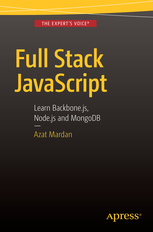

# Full Stack JavaScript: Learn Backbone.js, Node.js and MongoDB, 2nd and 3rd Editions

This is the manuscript (draft) and code for *Full Stack JavaScript, 3rd Edition* [Apress, 2017]. It's work in progress and the draft will be completed in the end of 2017. For the code of the 2nd edition, please visit [2nd-edition](https://github.com/azat-co/fullstack-javascript/releases/tag/2nd-edition).

*Full Stack JavaScript, 3rd Edition* is a JavaScript and Node.js book that will teach you how to build mobile and web apps fast.

# Book, Rights and Publishing

*Full Stack JavaScript, 3rd Edition* is a work-in-open book. It means that the book is written, updated and previewed in this reposition as free-to-read drafts, but are also being professionally edited, typeset, designed, produced, published, printed in soft cover and distributed to physical and electronic stores through the reputable tech publisher Apress Media.

If you find the content here useful in any form, prefer print version, prefer professionally produced Kindle, ePUB or PDF, or just want to support me and Apress to create more work-in-open projects like *Full Stack JavaScript, 3rd Edition*, please purchase the books once they are available for sale, through your normal physical or electronic book stores

If you'd like to contribute financially towards the effort (or any of my other open source work) aside from purchasing the books, or hire me as a speaker, write me an message via [my blog](https://webapplog.com/azat), or through [Twitter, Facebook or LinkedIn](http://azat.co).

# *Full Stack JavaScript, 3rd Edition* Table of Contents

* [Chapter 1: Basics](https://github.com/azat-co/fullstack-javascript/tree/master/chapter1/chapter1.md)
* [Chapter 2: Setup](https://github.com/azat-co/fullstack-javascript/tree/master/chapter2/chapter2.md)
* [Chapter 3: jQuery and Parse.com](https://github.com/azat-co/fullstack-javascript/tree/master/chapter3/chapter3.md)
* [Chapter 4: Intro to Backbone.js](https://github.com/azat-co/fullstack-javascript/tree/master/chapter4/chapter4.md)
* [Chapter 5: Backbone.js and Parse.com](https://github.com/azat-co/fullstack-javascript/tree/master/chapter5/chapter5.md)
* [Chapter 6: Intro to Node.js](https://github.com/azat-co/fullstack-javascript/tree/master/chapter6/chapter6.md)
* [Chapter 7: Intro to MongoDB](https://github.com/azat-co/fullstack-javascript/tree/master/chapter7/chapter7.md)
* [Chapter 8: Putting Frontend and Backend Together](https://github.com/azat-co/fullstack-javascript/tree/master/chapter8/chapter8.md)
* Conclusion and Further Reading

(It's work in progress and the draft will be completed in the end of 2017.)

# Live Corporate Training

Full Stack JavaScript, 3rd Edition is a work of 30+ in-person courses, workshops and classes delivered by me in-person at various companies (Walmart Labs, Cisco, Intuit, Starbucks, Capital One, OnDeck, HubSpot, VMWare to name just a few), dev schools (Hack Reactor, DevBootcamp, Flat Iron NY, etc.) and conferences (ForwardJS, Node Interactive and others). If you need a corporate remote/online or onsite in-person training delivered by me, then [send me a message](https://webapplog.com/azat).

# Live Public Training

[NodeProgram.com](http://nodeprogram.com) is the place to find out about next live (remote/online) and in-person workshops/seminars/classes.

# Self-Paced Training

[Node University](https://node.university) is the ultimate, most comprehensive and complete resource on Node.js and full stack JavaScript. [View free self-paced courses](https://node.university/courses/category/free) or view [all self-paced courses](https://node.university/courses).

# Contribution

TBD

# Supporters

*Full Stack JavaScript, 3rd Edition* was supported through [the Kickstarter campaign (funded in just three days)](https://www.kickstarter.com/projects/azat/practical-nodejs-book-2nd-edition-open-sourced-on). Thank you to the major backers of the book:

* **[DevelopIntelligence](http://www.developintelligence.com): Managed learning solutions including training design and development, program delivery and management** - $500
* Matthew Amacker - $200
* Jordan Horiuchi - $200
* Tim Chen - $175
* Alexey Bushnev - $175
* Aleksey Maksimov - $175
* Maurice van Cooten - $175
* Ryan - $175
* Ng Yao Min - $175
* Kommana Karteek - $160
* Elias Yousef - $150
* Arhuman - $150
* Javier Armendariz - $150
* Dave Anderson - $150
* Edithson Abelard - $150
* Ron Male - $145
* Win - $145
* Harold Avilez - $145
* Moe Joe - $145
* Guest 1871315922 - $145
* Philipp Jauss - $145
* Judy Herilla - $145
* Jaydev Dhinoja - $145
* Carlos Rodriguez - $145
* Pak - $145
* Jim Texter - $145
* David Wolff - $145
* German Yesid Rubiano Romero - $125
* shannon Johnstone - $125
* Mani Rana - $125
* Jeff Anderson - $125
* Tajinder Pal Singh - $125
* Sridhar Domakonda - $125
* Dieter - $125
* Felix Wang - $125
* Dan Jensen - $125
* Joel Register - $125
* Edgar Sanchez - $125
* Alexey - $125
* Peter Sjölin - $125
* Sksamy - $125
* Manuel Padrón Martínez - $125
* William Bartholomew - $125
* Sukesh Kumar Dash - $125
* Ross Matthews - $125
* Elaine David - $125
* Phil Aylesworth - $125
* 張大寶 - $125
* Vishnu - $125
* Jonathan Jou - $125
* Ernest Weems - $125
* Allen Lam - $125
* Martinerko - $125
* Sharif H. Khan - $125
* Larry Statham - $125
* Syllie - $125
* Eric J. - $125
* Jim Tyhurst - $125
* Oliver Schoenborn - $125
* Benjamin Sweetnam - $75
* Ian Partridge - $75
* Hafeez Syed - $75
* Chuck Huie - $75
* Thomas Greenhalgh - $75
* Sanghee Kim - $75
* JoeL Ivey - $75
* Clifford Lum - $75
* Ben Altieri - $75
* Patrick - $75
* Mani S - $75
* Simon St-Germain - $75
* Jaiyaramakrishnan Mahendran - $75
* Kevin Youkhana - $75
* Eymard Ventura - $75
* Matt Braun - $75
* Brent - $75
* Helio Alves - $75
* Matthew Winter - $75
* Omar Gómez Figueroa - $75
* Herwin Rey - $75
* Laura Steiner - $75
* Ben Manning - $75
* David le Blanc - $75
* Brian Chirgwin - $75
* Cédric Donner - $75
* Gary Poon - $75
* Mitchell Harpur - $75
* Beardsley Ruml - $50
* Swanand Kriyaban - $50
* Suhas - $50
* Yong Seok Jeon - $50
* Martin Moellenbeck - $45
* Mikael Wallin - $45
* Aakash Jain - $35
* Alexandru Nedel - $35
* John Bond - $35
* Michael Patrick R. Flores - $35
* Lou Yufan - $35
* Creative Area - $35
* Chew Chit Siang - $35
* Yuri Oliveira - $35
* Khoa Nguyen - $35
* Piti Champeethong - $35
* Siim Orasmäe - $25
* Jorge Ordoñez Mendez - $25
* Tim Goshinski - $25

## Source Code / Projects

* [01-bootstrap](https://github.com/azat-co/fullstack-javascript/tree/master/code/01-bootstrap): Bootstrap scaffolding example
* [03-weather](https://github.com/azat-co/fullstack-javascript/tree/master/code/03-weather): jQuery, OpenWeatherMap API and JSONP example
* [03-parse-sdk](https://github.com/azat-co/fullstack-javascript/tree/master/code/03-parse-sdk):  Parse JavaScript SDK example
* [03-board-parse-rest](https://github.com/azat-co/fullstack-javascript/tree/master/code/03-board-parse-rest): Message board front-end: jQuery and Parse.com REST API; ready for deployment.
* [04-backbone](https://github.com/azat-co/fullstack-javascript/tree/master/code/04-backbone): Diving Deeper into Backbone.js
* [05-board-backbone-parse-sdk](https://github.com/azat-co/fullstack-javascript/tree/master/code/05-board-backbone-parse-sdk): BackboneJS and Parse.com SDK Message Board
* [06-hello](https://github.com/azat-co/fullstack-javascript/tree/master/code/06-hello): NodeJS "Hello World" app
* [06-test](https://github.com/azat-co/fullstack-javascript/tree/master/code/06-test): Message Board back-end TDD with run-time storage
* [07-db-connect](https://github.com/azat-co/fullstack-javascript/tree/master/code/07-db-connect):  Local database connection test with MongoDB Native Driver
* [07-db-connect-heroku](https://github.com/azat-co/fullstack-javascript/tree/master/code/07-db-connect-heroku): Heroku database connection test with MongoDB Native Driver
* [07-db-server](https://github.com/azat-co/fullstack-javascript/tree/master/code/07-db-server): Server to list MongoDB collections
* [07-board-api-mongo](https://github.com/azat-co/fullstack-javascript/tree/master/code/07-board-api-mongo): Message Board API with MongoDB
* [08-board-ui](https://github.com/azat-co/fullstack-javascript/tree/master/code/08-board-ui): Message Board UI (front-end) without backend
* [08-board-api](https://github.com/azat-co/fullstack-javascript/tree/master/code/08-board-api): Message Board back-end with CORS
* [board-react](https://github.com/azat-co/fullstack-javascript/tree/master/code/board-react): Message Board with React.js view layer - BONUS PROJECT

## Work in Progress

* [board-react](https://github.com/azat-co/fullstack-javascript/tree/master/code/board-react): Message Board with React.js view layer (UI only)
* [board-react-meteor](https://github.com/azat-co/fullstack-javascript/tree/master/code/board-react-meteor): Message Board with React.js view layer (back-end and front-end)

# *Full Stack JavaScript, 2nd Edition*

* [2nd Edition Manuscript (starting point for 3rd Edition)](https://github.com/azat-co/fullstack-javascript/releases/tag/2nd-edition)
* Source Code (GitHub): <https://github.com/azat-co/fullstack-javascript/releases/tag/2nd-edition>
* Amazon: <http://amzn.to/1nIknSG>
* Apress: <http://www.apress.com/9781484217504>
* [Watch on YouTube!](https://www.youtube.com/playlist?list=PLguYmmjtxbWHfRTSK5jDS8M4vHCCggW3T)

