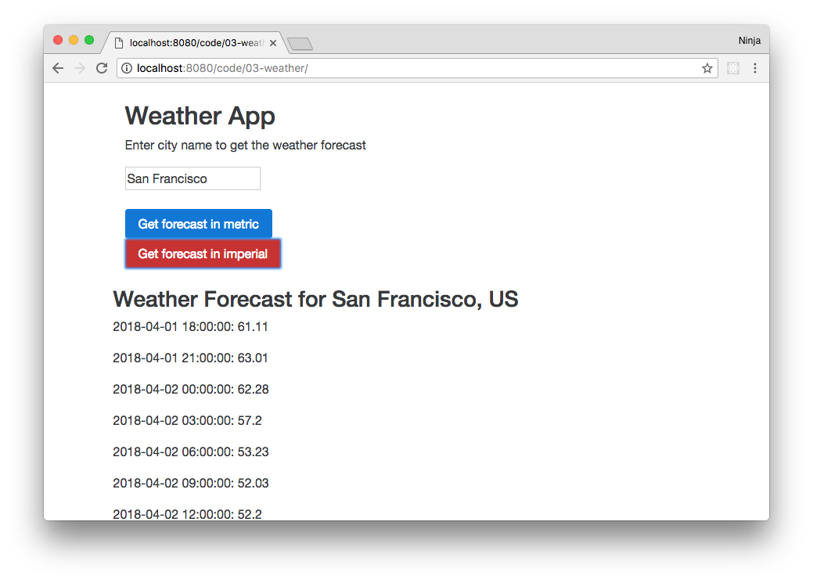
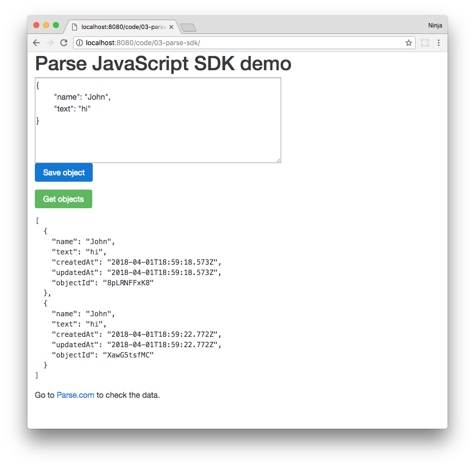
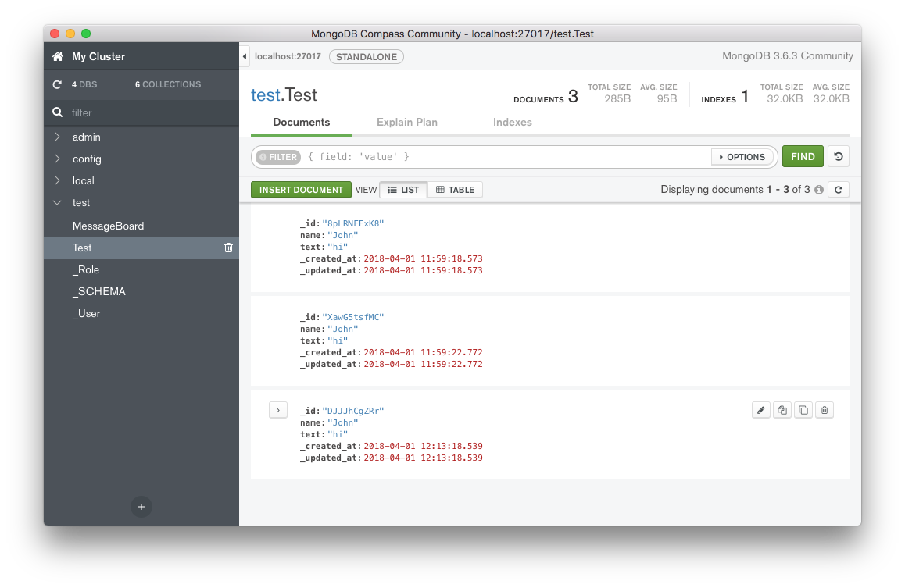
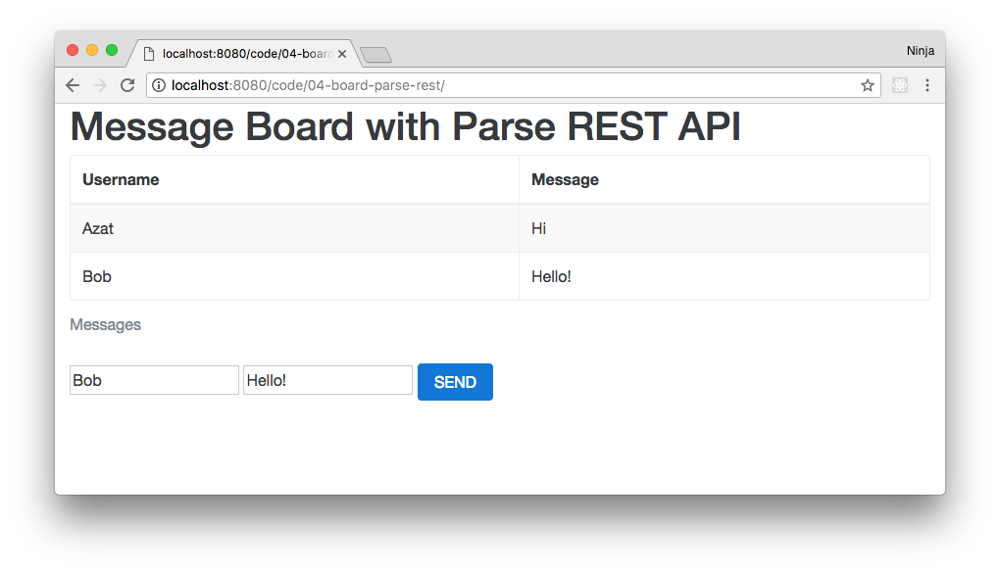
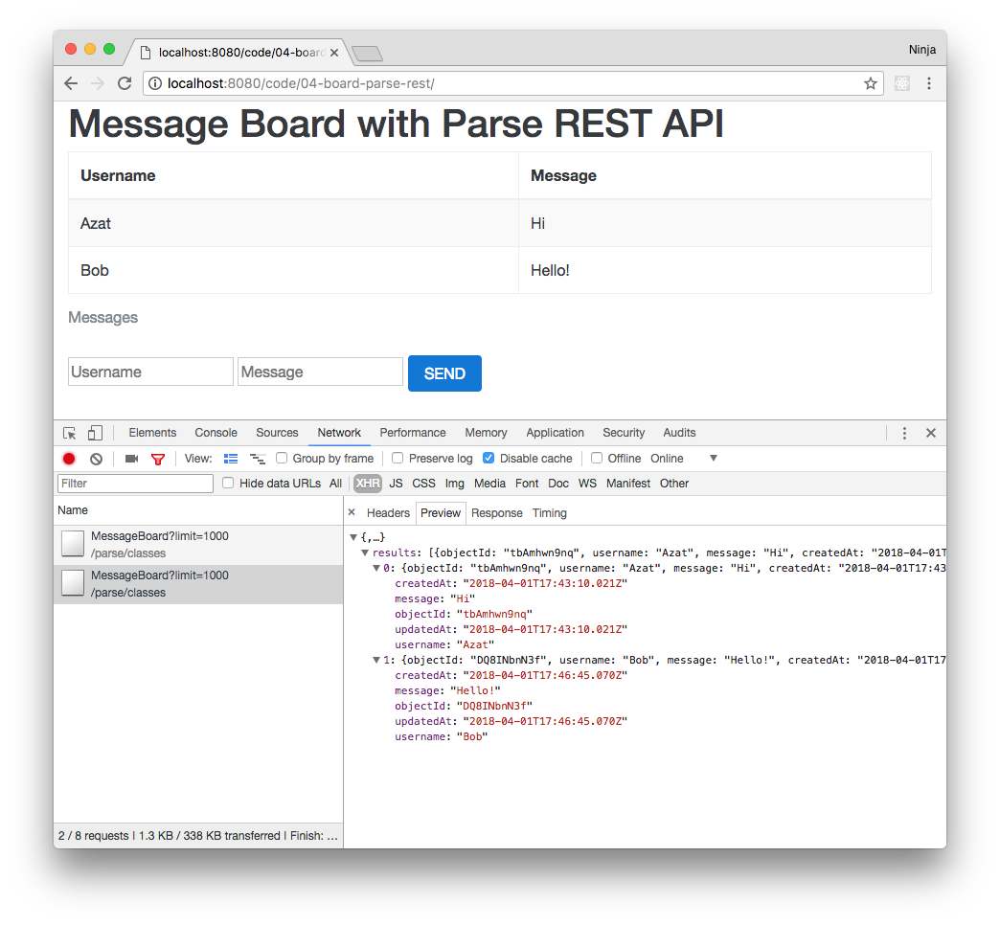

CHAPTER 3 
--------

Getting Data from Backend Using jQuery and Parse
====================

> *There are two ways of constructing a software design: One way is to
> make it so simple that there are obviously no deficiencies, and the
> other way is to make it so complicated that there are no obvious
> deficiencies. The first method is far more difficult.*
>
> — [Tony
> Hoare](http://en.wikipedia.org/wiki/Charles_Antony_Richard_Hoare)

This chapter covers the following topics:

-   Definitions of JSON, AJAX, and CORS

-   Overview of main jQuery functions

-   Twitter Bootstrap scaffolding

-   Main LESS components

-   Illustrations of JSONP calls on OpenWeatherMap API example

-   Parse overview

-   Explanations on how to build a Message Board front-end only
    application with jQuery and Parse

-   Step-by-step instructions on deployment to Windows Azure and Heroku

-   Updating and deleting of messages

This chapter is a basic introduction to front-end web development. It
covers things important to front-end development of apps such as Twitter
Bootstrap and LESS. These amazing libraries allow developers to have a
nice user interface in no time.

It covers the terminology and explains JSON, AJAX, and CORS. We then
explore the example of a weather app.

We use Parse as our back end to streamline things and make
development faster while still keeping it realistic. The cornerstone of
this chapter is a persistent message board application built with
Parse and jQuery.

Definitions
===========

Before anything else, let's clarify some terms. They are important
enough for us to pause and get familiar with them. If these are familiar
to you, you might want to skip ahead.

JavaScript Object Notation
--------------------------

Here is the definition of JavaScript Object Notation (JSON) from
www.[json.org](http://www.json.org/)

> JavaScript Object Notation, or JSON, is a lightweight data-interchange
> format. It is easy for humans to read and write. It is easy for
> machines to parse and generate. It is based on a subset of the
> JavaScript Programming Language, [Standard ECMA-262 3rd Edition -
> December
> 1999](http://www.ecma-international.org/publications/files/ECMA-ST/Ecma-262.pdf)
> ([www.ecma-international.org/publications/files/ECMA-ST/Ecma-262.pdf](http://www.ecma-international.org/publications/files/ECMA-ST/Ecma-262.pdf)).
>
> JSON is a text format that is completely language independent but uses
> conventions that are familiar to programmers of the C-family of
> languages, including C, C++, C\#, Java, JavaScript, Perl, Python, and
> many others. These properties make JSON an ideal data-interchange
> language.

JSON has become a standard for transferring data between different
components of web and mobile applications and third-party services. JSON
is also widely used inside the applications as a format for
configuration, locales, translation files, or any other data.

A typical JSON object looks like this:

    {
      "a": "value of a",
      "b": "value of b"
    }

We have an object with key/value pairs. Keys are on the left and values
are on the right side of colons (`:`). In computer science terminology,
JSON is equivalent to a hash table, a keyed list, or an associative
array (depending on the particular language). The only big difference
between JSON and JS object literal notation (native JS objects) is that
the former is more stringent and requires double quotes (`"`) for key
identifiers and string values. Both types can be serialized into a
string representation with `JSON.stringify()` and deserialized with
`JSON.parse()`, assuming we have a valid JSON object in a string
format.

However, every member of an object can be an array, primitive, or
another object; for example:

      {
        "posts": [{
          "title": "Get your mind in shape!",
          "votes": 9,
          "comments": ["nice!", "good link"]
          }, {
          "title": "Yet another post",
          "votes": 0,
          "comments": []
          }
        ],
        "totalPost": 2,
        "getData": function () {
          return new Data().getDate();
        }
      }

In this example, we have an object with the `posts` property. The
value of the `posts` property is an array of objects with each one of
them having `title`, `votes`, and `comments` keys. The `votes` property
holds a number primitive, whereas `comments` is an array of strings. We
also can have functions as values; in this case, the key is called a
method; that is, `getData`.

JSON is much more flexible and compact than XML or other data formats,
as outlined in this article: [JSON: The Fat-Free Alternative to
XML](http://www.json.org/xml.html) (www.json.org/xml.html).
Conveniently, MongoDB uses a JSON-like format called Binary JSON
(`http://bsonspec.org`) (BSON), discussed further in BSON later in
Chapter 7.

AJAX
----

Asynchronous JavaScript and XML (AJAX) is used on the client side
(browser) to send and receive data from the server by utilizing an
`XMLHttpRequest` object in JavaScript language. Despite the name, the
use of XML is not required, and JSON is often used instead. That's why
developers almost never say AJAX anymore. Keep in mind that HTTP
requests could be made synchronously, but it's not a good practice to do
so. The most typical example of a sync request would be the `<script>`
tag inclusion.

Cross-Domain Calls
------------------

For security reasons, the initial implementation of an XMLHTTPRequest
object did not allow for cross-domain calls, when a client-side code and
a server-side one are on different domains. There are methods to work
around this issue.

One of them is to use [JSONP](http://en.wikipedia.org/wiki/JSONP)
(http://en.wikipedia.org/wiki/JSONP), JSON with padding/prefix. It's
basically a dynamic manipulation via DOM generated `<script>` tag.
Script tags don't fall into the same domain limitation. The JSONP
request includes the name of a callback function in a request query
string. For example, the `jQuery.ajax() function` automatically
generates a unique function name and appends it to the request (which is
one string broken into multiple lines for readability):

    https://graph.facebook.com/search
      ?type=post
      &limit=20
      &q=Gatsby
      &callback=jQuery16207184716751798987_1368412972614&_=1368412984735

The second approach is to use cross-origin resource sharing
([CORS](http://www.w3.org/TR/cors) (<http://www.w3.org/TR/cors>),
which is a better solution, but it requires control over the server side
to modify response headers. We use this technique in the final version
of the Message Board example application. Here is an example of a CORS
server response header:

    Access-Control-Allow-Origin: *

More about CORS is available at [Resources by Enable
CORS](http://enable-cors.org/resources.html)
(http://enable-cors.org/resources.html) and Using CORS by HTML5 Rocks
Tutorials (`http://www.html5rocks.com/en/tutorials/cors/`). You can test
CORS requests at
[`test-cors.org`](http://client.cors-api.appspot.com/client).

jQuery Functions
================

During the training we'll be using jQuery
([http://jquery.com](http://jquery.com)) for DOM manipulations, HTTP
Requests, and JSONP calls. jQuery became a de facto standard because of
its `$` object or function, which provides a simple yet efficient way to
access any HTML DOM element on a page by its ID, class, tag name,
attribute value, structure, or any combination thereof. The syntax is
very similar to CSS, where we use `#` for id and `.` for class
selection. For example:

    $('#main').hide()
    $('p.large').attr('style','color:red')
    $('#main').show().html('<div>new div</div>')

Here is the list of most commonly used jQuery API functions:

-   `find()(http://api.jquery.com/find)`: Selects elements based on
    the provided selector string

-   `hide()(http://api.jquery.com/hide)`: Hides an element if it was
    visible

-   `show()(http://api.jquery.com/show)`: Shows an element if it was
    hidden

-   `html()(http://api.jquery.com/html)`: Gets or sets an inner HTML
    of an element

-   `append()(http://api.jquery.com/append)` Injects an element into
    the DOM after the selected element

-   `prepend()(http://api.jquery.com/prepend)` Injects an element
    into the DOM before the selected element

-   `on()(http://api.jquery.com/on)`: Attaches an event listener to an
    element

-   `off()(http://api.jquery.com/off)` Detaches an event listener from
    an element

-   `css()(http://api.jquery.com/css)`: Gets or sets the style
    attribute value of an element

-   `attr()(http://api.jquery.com/attr)` Gets or sets any attribute
    of an element

-   `val()(http://api.jquery.com/val)`: Gets or sets the value
    attribute of an element

-   `text()(http://api.jquery.com/text)`: Gets the combined text of
    an element and its children

-   `each()(http://api.jquery.com/each)`: Iterates over a set of
    matched elements

Most jQuery functions act not only on a single element, on which they
are called, but on a set of matched elements if the result of the
selection has multiple items. This is a common pitfall that leads to
bugs, and it usually happens when a jQuery selector is too broad.

Also, jQuery has many available plug-ins and libraries that provide a
rich user interface or other functionality. For example:

-   [jQuery UI](http://jqueryui.com/) (http://jqueryui.com)
-   [jQuery Mobile](http://jquerymobile.com/) (http://jquerymobile.com)

Twitter Bootstrap
=================

<span id="OLE_LINK26" class="anchor"><span id="OLE_LINK27"
class="anchor"></span></span>Supplemental video which walks you through
the implementation and demonstrates the project: <http://bit.ly/1RKx9uY>.

[Twitter Bootstrap](http://getbootstrap.com) (http://getbootstrap.com)
is a collection of CSS/LESS rules and JavaScript plug-ins for creating a
good user interface and user experience without spending a lot of time
on such details as rounded-edge buttons, cross-compatibility,
responsiveness, and so on. This collection or framework is perfect for
rapid prototyping of your ideas. Nevertheless, due to its ability to be
customized, Twitter Bootstrap is also a good foundation for serious
projects. The source code is written in [LESS](http://lesscss.org)
(http://lesscss.org), but plain CSS can be downloaded and used as well.

Here is a simple example of using Twitter Bootstrap scaffolding for the
version v4.0.0-alpha. The structure of the project should look like
this:

      /01-bootstrap
        -index.html
        /css
          -bootstrap.css    
          -bootstrap.min.css
          ... (other files if needed)
        /js
          -bootstrap.js
          -bootstrap.min.js
          -npm.js

First let's create the `index.html` file with proper tags:

    <!DOCTYPE html>
    <html lang="en">
      <head>

      </head>
      <body>
      </body>
    </html>

Include the Twitter Bootstrap library as a minified CSS file:

    <!DOCTYPE html>
    <html lang="en">
      <head>
        <link
          type="text/css"
          rel="stylesheet"
          href="css/bootstrap.min.css" />
      </head>
      <body>
      </body>
    </html>

Apply scaffolding with `container-fluid` and `row-fluid` classes:

      <body >
        <div class="container-fluid">
          <div class="row-fluid">
          </div>  *<!--row-fluid -->*
        </div>  *<!-- container-fluid -->*
      </body>

Twitter Bootstrap uses a 12-column grid. The size of an individual cell
could be specified by classes `spanN`, for example, `span1`, `span2`,
`span12`. There are also classes `offsetN`, for example, `offset1`,
`offset2`, ... `offset12`, to move cells to the right. A complete
reference is available at
[`http://twitter.github.com/bootstrap/scaffolding.html`](http://twitter.github.com/bootstrap/scaffolding.html).

We'll use the `span12` and `hero-unit` classes for the main content
block:

        <div class="row-fluid">
         <div class="span12">
            <div id="content">
              <div class="row-fluid">
                <div class="span12">
                  <div class="hero-unit">
                    <h1>
                      Welcome to Super
                      Simple Backbone
                      Starter Kit
                    </h1>
                    <p>
                      This is your home page.
                      To edit it just modify
                      the <i>index.html</i> file!
                    </p>
                    <p>
                      <a
                        class="btn btn-primary btn-large"
                        href="http://twitter.github.com/bootstrap"
                        target="_blank">
                        Learn more
                      </a>
                    </p>
                  </div>  *<!-- hero-unit -->*
                </div>  *<!-- span12 -->*
              </div> *<!-- row-fluid -->*
          </div>  *<!-- content -->*
        </div> *<!-- span12 -->*
        </div>  *<!-- row-fluid -->*

This is the full source code of the `index.html` from
[1-bootstrap](https://github.com/azat-co/fullstack-javascript/tree/master/1-bootstrap):

    <!DOCTYPE html>
    <html lang="en">
    <head>
        <link type="text/css" rel="stylesheet" href="css/bootstrap.css" />
    </head>
        <body >
            <div class="container-fluid">
                <div class="row-fluid">
                    <div class="span12">
                        <div id="content">
                            <div class="row-fluid">
                                <div class="span12">
                                    <div class="hero-unit">
                                        <h1>Welcome to Super Simple Backbone Starter Kit</h1>
                                        <p>This is your home page. To edit it just modify <i>index.html</i> file!</p>
                                        <p><a class="btn btn-primary btn-large" href="http://twitter.github.com/bootstrap" target="_blank" >Learn more </a></p>
                                    </div>  *<!-- hero-unit -->*
                                </div>  *<!-- span12 -->*
                            </div> *<!-- row-fluid -->*
                    </div>  *<!-- content -->*
                </div> *<!-- span12 -->*
            </div>  *<!-- row-fluid -->*
        </div>  *<!-- container-fluid -->*
    </body>
    </html>

This example is available for downloading and pulling from the GitHub
public [repository at
`github.com/azat-co/fullstack-javascript`](https://github.com/azat-co/fullstack-javascript)
under the [01-bootstrap
folder](https://github.com/azat-co/fullstack-javascript/tree/master/code/01-bootstrap)
(https://github.com/azat-co/fullstack-javascript/tree/master/code/01-bootstrap).
If you prefer to watch screencasts, I recorded one on YouTube
(http://bit.ly/1RKx9uY).

This and other videos, will walk you through the same steps as outlined
in the book. So if you are reading this book in print, no worries. The
information in the book is enough.

Here are some other useful tools—CSS frameworks and CSS
preprocessors—worth checking out:

-   [*Compass*](http://compass-style.org/)*:* CSS
    framework (http://compass-style.org/)

-   [*SASS*](http://sass-lang.com/)*:* Extension of CSS3 and analog to
    LESS (http://sass-lang.com/)

-   [*Blueprint*](http://blueprintcss.org/)*:* CSS
    framework (http://blueprintcss.org/)

-   [*Foundation*](http://foundation.zurb.com/)*:* Responsive front-end
    framework (http://foundation.zurb.com/)

-   [*Bootswatch*](http://bootswatch.com/)*:* Collection of customized
    Twitter Bootstrap themes (http://bootswatch.com/)

-   [*WrapBootstrap*](https://wrapbootstrap.com/)*:* Marketplace for
    customized Bootstrap themes (https://wrapbootstrap.com/)

To work with the Twitter Bootstrap source file, you need to use LESS or
[SASS](https://github.com/twbs/bootstrap-sass) (another CSS framework
similar to LESS).

LESS
====

LESS is a dynamic stylesheet language. Sometimes, and in this case, it's
true that less is more and more is less. A browser cannot interpret LESS
syntax, so LESS source code must be compiled to CSS in one of the three
ways:

1.  In the browser by the LESS JavaScript library

2.  On the server side by language or framework; for example, for
    Node.js there is the [LESS
    module](https://npmjs.org/package/less) (https://www.npmjs.com/package/less)

3.  Locally on your machine by command line (installed with npm by
    running `$ npm install -g less`), [WinLess](http://winless.org)
    (http://winless.org/), [LESS App](http://incident57.com/less)
    (http://incident57.com/codekit/index.html),
    [SimpLESS](http://wearekiss.com/simpless)
    (http://wearekiss.com/simpless), or a similar app

The browser option is suitable for a development environment, but
suboptimal for a production environment.

LESS has variables, mix-ins, and operators that make it faster for
developers to reuse CSS rules.

LESS Variables
--------------

Variables reduce redundancy and allow developers to change values
quickly by having them in one canonical place, and we know that in
design (and styling) we often have to change values very frequently.

We sometimes have some LESS code with the variable marked by the `@`
sign, such as in `@color`:

    @color: #4D926F;
    #header {
      color: @color;
    }
    h2 {
      color: @color;
    }

This code will be compiled to the equivalent in CSS:

    #header {
      color: #4D926F;
    }
    h2 {
      color: #4D926F;
    }

The benefit is that in LESS, you need to update the color value in only
one place versus two in CSS. This is abstraction at its best.

LESS Mix-ins
------------

This about mix-ins as functions. The syntax for a mix-in is the same as
for creating a class selector. For example this is a `.border` mix-in:

    .border {
        border-top: dotted 1px black;
        border-bottom: solid 2px black;
    }
    #menu a {
        color: #111;
        .border;
    }
    .post a {
        color: red;
        .border;
    }

That converts into this CSS, in which the `.border` is replaced with the
actual styles, not the name:

    .border {
      border-top: dotted 1px black;
      border-bottom: solid 2px black;
    }
    #menu a {
      color: #111;
      border-top: dotted 1px black;
      border-bottom: solid 2px black;
    }
    .post a {
      color: red;
      border-top: dotted 1px black;
      border-bottom: solid 2px black;
    }

Even more useful is to pass a parameter to a mix-in. This enables
developers to create even more versatile code. For example,
`.rounded-corners` is a mix-in that can change size based on the value
of the parameter `radius`:

    .rounded-corners (@radius: 5px) {
      border-radius: @radius;
      -webkit-border-radius: @radius;
      -moz-border-radius: @radius;
    }

    #header {
      .rounded-corners;
    }
    #footer {
      .rounded-corners(10px);
    }

That code will compile into this in CSS:

    #header {
      border-radius: 5px;
      -webkit-border-radius: 5px;
      -moz-border-radius: 5px;
    }
    #footer {
      border-radius: 10px;
      -webkit-border-radius: 10px;
      -moz-border-radius: 10px;
    }

Whether you use mix-ins without parameters or with multiple parameters,
they are great at creating abstractions and enabling better code reuse.

LESS Operations
---------------

LESS supports operations. With operations, we can perform math functions
on numbers, colors, or variables. This is useful for sizing, colors, and
other number-related styles.

Here is an example of an operator in LESS where we perform
multiplication and addition:

    @the-border: 1px;
    @base-color: #111;
    @red:        #842210;

    #header {
      color: @base-color * 3;
      border-left: @the-border;
      border-right: @the-border * 2;
    }
    #footer {
      color: @base-color + #003300;
      border-color: desaturate(@red, 10%);
    }

That code compiles in this CSS in which the compiler substituted
variables and operations for the results of the expressions:

    #header {
      color: #333333;
      border-left: 1px;
      border-right: 2px;
    }
    #footer {
      color: #114411;
      border-color: #7d2717;
    }

As you can see, LESS dramatically improves the reusability of plain CSS.
It's a time saver in large projects, as you can create LESS modules and
reuse them in multiple apps.

Other important [LESS features](http://lesscss.org/#docs)
(<http://lesscss.org/#docs>) include the following:

-   Pattern-matching

-   Nested rules

-   Functions

-   Namespaces

-   Scope

-   Comments

-   Importing

An Example Using a Third-Party API (OpenWeatherMap) and jQuery
==============================================================

Supplemental video which walks you through the implementation and
demonstrates the project: <http://bit.ly/1RKxyxA>.

This example is for purely demonstrative purposes. It is not a part of
the main Message Board application covered in later chapters. The goal
is to just illustrate the combination of jQuery, JSONP, and REST API
technologies.


The idea of this weather application is to show you an input field for
the city name and buttons for metric and imperial systems. The first page of the Weather application has the input field for the city name and two buttons for metric and imperial forecasts (Figure 3-1).


***Figure 3-1.** Weather App has a text input field and two button for the forecasts.*

Once you enter the city name and click one of the buttons, the app will fetch the
forecast from OpenWeatherMap. Depending on what button is pressed, the app will fetch the forecast in metric (C) or imperial (F) degrees. For example, I like in the heart of tech innovation, San Francisco and we use imperial F degrees here so my result will be similar to the one shown in Figure 3-2. The forecast will be for several days with a 3-hour difference between predictions.



***Figure 3-2.** Weather App show the forecast for San Francisco.*


Note that this example uses [OpenWeatherMap
API](http://openweathermap.org) 2.5. The API requires an authentication
(an app ID) for REST calls. You can get the necessary keys at
<http://openweathermap.org/appid>. The API
documentation is available at
<http://openweathermap.org/api>. If you are starting the weather app from the code folder of the repository for this book, then make sure you update the API key as you might have my API key there which might not work in the future.

In this example, we'll use jQuery's `$.ajax()` function. It has
the following syntax:

    const request = $.ajax({
        url: url,
        dataType: 'jsonp',
        data: {q: cityName, appid: appId, units: units},
        jsonpCallback: 'fetchData',
        type: 'GET'
      }).fail(function(error){
        console.error(error)
        alert('Error sending request')
      })

In the code fragment of an `ajax()` function just shown, we used
the following parameters:

-   `url` is an endpoint of the API.

-   `dataType` is the type of data we expect from the server; for
    example, "json", "xml", "jsonp" (JSON with prefix—format for servers
    that don't support CORS).

-   `data` is the data to be sent to the server.

-   `jsonpCallback` is a name of the function, in a string format, to be
    called after the request comes back; by default jQuery will create
    a name.

-   `type` is HTTP method of the request; for example, "GET", "POST".

There is also a chained method `.fail`, which has logic for what to do
when the request has an error (i.e., it fails).

For more parameters and examples of the `ajax()` function, go to
[`api.jquery.com/jQuery.ajax`](http://api.jquery.com/jQuery.ajax/).

To assign our function to a user-triggered event, we need to use the
`click` function from the jQuery library. The syntax is very simple:

    $('#btn').click(function() {
      ...
    }

`$('#btn')` is a jQuery object that points to an HTML element
in the DOM with the `id` of `btn`.

To make sure that all of the elements we want to access and use are in
the DOM, we need to enclose all of the DOM manipulation code inside of
the following jQuery function:

    $(document).ready(function(){
      ...
    }

This is a common mistake with dynamically generated HTML elements. They
are not available before they have been created and injected into the
DOM.

We must put the event handlers for the buttons in the
`$(document).ready()` callback. Otherwise, the code might try to
attach an event listener to a nonexisting DOM element. The
`$(document).ready()` ensures that the browser rendered all the DOM
elements.

    $(document).ready(function(){
      $('.btn-metric').click(function() {
        prepareData('metric')
      })
      $('.btn-imperial').click(function() {
        prepareData('imperial')
      })
    })

We use classes instead of IDs, because classes are more flexible (you
cannot have more than one ID with the same name). Here's the HTML code
for the buttons:

    <div class="row">
      <div class="span6 offset1">
        <input type="button" class="btn-primary btn btn-metric" value="Get forecast in metric"/>
      <div class="span6 offset1">
        <input type="button" class="btn-danger btn btn-imperial" value="Get forecast in imperial"/>
      </div>  
      <div class="span3">
        <p id="info"></p>
      </div>
    </div>

The last container with the ID `info` is where we'll put the forecast.

The idea is simple: We have button and event listeners to do something
once a user clicks the buttons. The aforementioned buttons call the
`prepareData()` method. This is its definition:

    const openWeatherAppId = 'GET-YOUR-KEY-AT-OPENWEATHERMAP',
      openWeatherUrl = 'http://api.openweathermap.org/data/2.5/forecast'

    const prepareData = function(units) {
      var cityName = $('#city-name').val()
      if (cityName && cityName != ''){
        cityName = cityName.trim()
        getData(openWeatherUrl, cityName, openWeatherAppId, units)
      }
      else {
        alert('Please enter the city name')
      }
    }

The code should be straightforward. We get the value of the city name
from the input box, check that it's not empty, and call `getDada()`,
which will make the XHR request to the server. You've already seen an
example of the `$.ajax` request. Please note that the callback
function is named `fetchData`. This function will be called after
the browser gets the response from the OpenWeatherMap API. Needless to
say, we must pass the city name, app ID, and units as follows:

    function getData (url, cityName, appId, units) {
      const request = $.ajax({
        url: url,
        dataType: 'jsonp',
        data: {
          q: cityName,
          appid: appId,
          units: units
        },
        jsonpCallback: 'fetchData',
        type: 'GET'
      }).fail(function(error){
        console.error(error)
        alert('Error sending request')
      })
    }

The JSONP fetching function magically (thanks to jQuery) makes
cross-domain calls by injecting script tag, and appending the callback
function name to the request query string.

At this point, we need to implement `fetchData` and update the view with
the forecast. The `console.log` is useful to look up the data structure
of the response; that is, where fields are located. The city name and
country will be displayed above the forecast to make sure the location
found is the same as the one we requested in the input box.

    function fetchData (forecast) {
        console.log(forecast)
        let html = '',
          cityName = forecast.city.name,
          country = forecast.city.country

Now we form the HTML by iterating over the forecast and concatenating
the string:

    html += `<h3> Weather Forecast for ${cityName}, ${country}</h3>`
    forecast.list.forEach(function(forecastEntry, index, list){
        html += `<p>${forecastEntry.dt_txt}:${forecastEntry.main.temp}</p>`
    })

Finally, we get a jQuery object for the div with ID `log`, and inject
the HTML with the city name and the forecast:

    $('#log').html(html)

In a nutshell, there is a button element that triggers
`prepareData()`, which calls `getData()`, in the callback of which
is `fetchData()`. If you found that confusing, here's the full code of
the `index.html` file:

```html
<!DOCTYPE html>
<html lang="en">
<head>
	<link type="text/css" rel="stylesheet" href="css/bootstrap.css" />
	<script src="js/jquery.js" type="text/javascript"></script>
	<meta name="viewport" content="width=device-width, initial-scale=1.0">
	<style type="text/css">
		.row {
			padding-top:1.5em;
		}
	</style>
	<script>
		const openWeatherAppId = 'GET-YOUR-KEY-AT-OPENWEATHERMAP',
		  openWeatherUrl = 'http://api.openweathermap.org/data/2.5/forecast'

		const prepareData = function(units) {
			// Replace loading image
			let cityName = $('#city-name').val()
			// Make ajax call, callback
			if (cityName && cityName != ''){
				cityName = cityName.trim()
				getData(openWeatherUrl, cityName, openWeatherAppId, units)
			}
			else {
				alert('Please enter the city name')
			}
		}
		$(document).ready(function(){
			$('.btn-metric').click(function() {
				prepareData('metric')
			})
			$('.btn-imperial').click(function() {
				prepareData('imperial')
			})

		})
		function getData (url, cityName, appId, units) {
			const request = $.ajax({
				url: url,
				dataType: "jsonp",
				data: {q: cityName, appid: appId, units: units},
				jsonpCallback: "fetchData",
				type: "GET"
			}).fail(function(error){
				console.error(error)
				alert('Error sending request')
			})
		}
		function fetchData (forecast) {
			console.log(forecast)
			let html = '',
			  cityName = forecast.city.name,
				country = forecast.city.country

			html += `<h3> Weather Forecast for ${cityName}, ${country}</h3>`
			forecast.list.forEach(function(forecastEntry, index, list){
				html += `<p>${forecastEntry.dt_txt}:${forecastEntry.main.temp}</p>`
			})

			$('#log').html(html)
		}
	</script>
</head>
<body>
	<div class="container">

		<div class="row">
			<div class="span4 offset 3">
				<h2>Weather App</h2>
				<p>Enter city name to get the weather forecast</p>
			</div>
			<div class="span6  offset1"><input class="span4" type="text" placeholder="Enter the city name" id="city-name" value=""/>
			</div>

		</div>
		<div class="row">
			<div class="span6 offset1">
                <input type="button" class="btn-primary btn btn-metric" value="Get forecast in metric"/>
			<div class="span6 offset1">
                <input type="button" class="btn-danger btn btn-imperial" value="Get forecast in imperial"/>
			</div>			
		</div>

		<div class="row">
			<div class="span6 offset1">
				<div id="log">Nothing to show yet</div>
			</div>
		</div>

		<div class="row">
			<hr/>
			<p>Azat Mardan (<a href="http://twitter.com/azat_co">@azat_co</a>)</p>
		</div>

	</div>

</body>
</html>
```

Try launching it and see if it works with or without the local HTTP
server (just opening `index.html` in the browser). It should not work
without an HTTP server because of its reliance on JSONP technology. You
can get `http-static` or `http-server` command-line tools as described
in Chapter 2.

The source code is available in the
[`03-weather`](https://github.com/azat-co/fullstack-javascript/tree/master/code/03-weather)
folder and on GitHub (https://github.com/azat-co/fullstack-javascript/tree/master/code/03-weather). Don't forget that there's a [screencast video on YouTube](http://bit.ly/1RKxyxA) which walks you through the implementation and demonstrates the app.

This example was built with OpenWeatherMap API v2.5 and might not work
with later versions. Also, you need the API key called app ID. You can
get the necessary keys at
[`openweathermap.org/appid`](http://openweathermap.org/appid). If you
feel that there must be a working example, please submit your feedback
to [the GitHub repository for the book's projects](https://github.com/azat-co/fullstack-javascript) (https://github.com/azat-co/fullstack-javascript).

jQuery is a good library for getting data from the RESTful servers.
Sometimes we are not just reading the data from the servers; we also
want to write it. This way the information persists and can be accessed
later. Parse will allow you to save your data without friction.

Parse
=========

Supplemental video which walks you through the implementation and
demonstrates the project: <http://bit.ly/1SU8imX>.

[Parse](http://parseplatform.org) (http://parseplatform.org) is a platform which is a collection of server and client libraries that offer a feature-rich backend. With Parse server, developers can focus on building their client apps (web or mobile) because they'll have a substitute for a database and a server. In other words, with Parse, there's no need to build your own server or to maintain a database! 

Parse started as means to
support mobile application development. Nevertheless, with the REST API
and the JavaScript SDK, Parse can be used in any web and desktop
applications for data storage (and much more), making it ideal for rapid
prototyping. 

To create a local instance of Parse simply install two npm modules: `parse-server` and `mongodb-runner` using npm:

```
npm i -g parse-server mongodb-runner
```

Then launch the mongoDB with `mongodb-runner start`. You'll see this message:

```
  ◝ Starting a MongoDB deployment to test against...✔  Downloaded MongoDB 3.6.3
  ◟ Starting a MongoDB deployment to test against...
```


That's it. You can create your own backend locally with the next command which take API key and ID and points to the local DB:

```
parse-server --appId APPLICATION_ID --masterKey MASTER_KEY --databaseURI mongodb://localhost/test
```


Create your backend Parse server application. Feel free to use your own values for `appId` and `masterKey`. Copy the Application ID, master key into the front end project files such as 03-parse-sdk/app.js because you'll need to use the exact the same value on the front end in order to be able to access your backend server. In other words, we'll need these keys to access our data collection at Parse. 

We'll create a simple application that will save values to the
collections using the Parse JavaScript SDK. The final solution is in the 03-parse-sdk folder. Our application will
consist of an `index.html` file and an `app.js` file. Here is the
structure of our project folder:

    /03-parse-sdk
      -index.html
      -app.js
      -jquery.js
      /css
        -boostrap.css

The sample is available in the
[`03-parse-sdk`](https://github.com/azat-co/fullstack-javascript/tree/master/code/03-parse-sdk)
folder on GitHub
(https://github.com/azat-co/fullstack-javascript/tree/master/code/03-parse-sdk),
but you are encouraged to type your own code from scratch. To start,
create the `index.html` file:

    <html lang="en">
    <head>

Include the minified jQuery v2.1.4 library from the local file (you can
download and save it into the folder):

      <script
        type="text/javascript"
        src=
        "jquery.js">
      </script>

Include the Parse JavaScript SDK library v1.11.7 from this location <https://unpkg.com/parse@1.11.1/dist/parse.js>
 or from code/libraries:

      <script src="parse-1.11.1.js"></script>

Include our `app.js` file and the Twitter Bootstrap v4.0.0-alpha:

      <script type="text/javascript" src="app.js"></script>
      <link type="text/css" rel="stylesheet" href="css/bootstrap.css" />
    </head>
    <body>
    *<!-- We'll do something here -->*
    </body>
    </html>

The `<body>` of the HTML page consists of the `<textarea>`
element. We'll use it to enter JSON:

    <body>
        <div class="container-fluid">
            <div class="row-fluid">
                <div class="span12">
                    <div id="content">
                        <div class="row-fluid">
                            <div class="span12">
                                <div class="hero-unit">
                                    <h1>Parse JavaScript SDK demo</h1>
                                    <textarea cols="60" rows="7">{
      "name": "John",
      "text": "hi"
    }</textarea>

The indentation of the `<textarea>` looks out of whack because
this element preserves white space and we don't want to have it when we
process that string into JSON.

After the input area, there's a button that will trigger the saving to
Parse:

                                    <p><a class="btn btn-primary btn-large btn-save" >Save object</a></p>
                                    <pre class="log"></pre>
                                    Go to <a href="http://parseplatform.org/" target="_blank">Parse</a> to check the data.
                                </div>  *<!-- hero-unit -->*
                            </div>  *<!-- span12 -->*
                        </div> *<!-- row-fluid -->*
                </div>  *<!-- content -->*
            </div> *<!-- span12 -->*
        </div>  *<!-- row-fluid -->*
        </div>  *<!-- container-fluid -->*


    </body>
    </html>

Create the `app.js` file and use the `$(document).ready` function to
make sure that the DOM is ready for manipulation:

```js
    $(document).ready(function() {
```

Change `parseApplicationId` and `parseJavaScriptKey` to values for your own
Parse server (you define them when you start the Parse server):

```js
const parseApplicationId = 'APPLICATION_ID'
const parseJavaScriptKey = 'MASTER_KEY'	
```

Because we've included the Parse JavaScript SDK library, we now have
access to the global object `Parse`. We initialize a connection with the
keys, and create a reference to a `Test` collection:

```js
Parse.initialize(parseApplicationId, parseJavaScriptKey)
Parse.serverURL = 'http://localhost:1337/parse'
```      

Next, create the collection object. It's like a model for our data. The name is `Test` but it can be any string value. 

```js
const Test = Parse.Object.extend('Test')
const test = new Test()
const query = new Parse.Query(Test)
```

The next step is to implement the code to save an object with the keys `name` and `text` to
the Parse `Test` collection. We are going to use `test.save()`:

```js
test.save(obj, {success, error})
```

But before we can call `save()`, we must get the data from the DOM (browser element `textarea`). The next few statements deal with getting your JSON from the `<textarea>` and parsing it into a normal JavaScript object. The `try/catch` is crucial because the JSON structure is very rigid. You cannot have any extra symbols. Each time there's a syntax error, it will break the entire app. Therefore, we need to account for erroneous
syntax:

```js
try {
    const data = JSON.parse($('textarea').val())
} catch (e) {
    alert('Invalid JSON')
}
```

Conveniently, the `save()` method accepts the callback parameters
`success` and `error` just like the `jQuery.ajax()` function. To get a
confirmation, we'll just have to look at the `log` container
(`<pre class="log"></pre>`) on the page:

    test.save(data, {
        success: (result) => {
            console.log('Parse.com object is saved: ', result)
                $('.log').html(JSON.stringify(result, null, 2))
            //alternatively you could use alert('Parse object is saved')
        },
        error: (error) => {
            console.log(`Error! Parse.com object is not saved: ${error}`)
        }
    })

It's important to know why we failed to save an object. That's why there's an error callback.

We will also implement a method to get all object from Test. We will use `query.find()`.


Just so you don't have to click on the Github link (or type it from the
book) to look up the full source code of the `app.js` file, I provide
it here:

```js
// Azat's app, change these values to your own keys
const parseAppID = 'APPLICATION_ID'
const parseRestKey = 'MASTER_KEY'
const apiBase = `http://localhost:1337/parse`

$(document).ready(function(){
  getMessages()
  $('#send').click(function(){
    const $sendButton = $(this)
    $sendButton.html('')
    const username = $('input[name=username]').val()
    const message = $('input[name=message]').val()
    $.ajax({
      url: `${apiBase}/classes/MessageBoard`,
      headers: {
        'X-Parse-Application-Id': parseAppID,
        'X-Parse-REST-API-Key': parseRestKey
      },
      contentType: 'application/json',
      dataType: 'json',
      processData: false,
      data: JSON.stringify({
        'username': username,
        'message': message
      }),
      type: 'POST',
      success: function() {
        console.log('sent')
        getMessages()
        $sendButton.html('SEND')
      },
      error: function() {
        console.log('error')
        $sendButton.html('SEND')
      }
    })
  })
})

function getMessages() {
  $.ajax({
    url: `${apiBase}/classes/MessageBoard?limit=1000`,
    headers: {
      'X-Parse-Application-Id': parseAppID,
      'X-Parse-REST-API-Key': parseRestKey
    },
    contentType: 'application/json',
    dataType: 'json',
    type: 'GET',
    success: (data) => {
      console.log('get')
      updateView(data)
    },
    error: () => {
      console.log('error')
    }
  })
}

function updateView(messages) {
  // messages.results = messages.results.reverse()
  const table = $('.table tbody')
  table.html('')
  $.each(messages.results, (index, value) => {
    const trEl = (`<tr><td>
      ${value.username}
      </td><td>
      ${value.message}
      </td></tr>`)
    table.append(trEl)
  })
  console.log(messages)
}

```


To run the app, start your local web server at the project folder and
navigate to the address (e.g.,
<http://localhost:8080>) in your browser. Or you can start the static web server from my book repository. The difference is that you'll have to provide the path `code/03-parse-sdk` if you start from the book repository folder (root). If you start from the project folder then you do not provide the path because the index.html file is right in the project folder. Note that if
you get a 401 Unauthorized error from Parse, that's probably because
you have the wrong API key. Make sure you use the same key in your JavaScript as you used when you started the parse server from the command line. Of course, if you haven't started your parse serve, do so now because we cannot connect to a server if it's not running (duh!).

If everything was done properly, you should be able to see the `Test` in
Parse's Data Browser populated with values "John" and "hi" (Figure 3-3). Also,
you should see the proper message with the newly created ID. Parse
automatically creates object IDs and timestamps, which will be very
useful in our Message Board application.



***Figure 3-4.** Save button will send the object to the backend which will save it to the database.*

If you press on the Get object (green button), then you'll get all the objects which are stored in the database. How to confirm that this data is actually store in the database and won't disappear when we close the browser? Simply, close the browser and open it again. If still not convinced, use Mongo shell/REPL or Compass (Figure 3-4) to go to the local MongoDB database instance and the Test collection. There will be the data just sitting and looking at you.




***Figure 3-5.** Compass shows in MongoDB the data which was sent from the browser.*

Parse also has thorough instructions for the various parts of platform including its server and clients libraries: <http://docs.parseplatform.org>. You can deploy parse server into cloud or your own data center. Parse supports containers too.

With Parse we can use browser JavaScript, one command-line (parse-server) and wheyee! We can save to the database straight from the browser!!! 

Let’s move on to the Message Board app.

Message Board with Parse Overview
=====================================

Supplemental video which walks you through the implementation and
demonstrates the project: <http://bit.ly/1SU8pyS>.

The Message Board will consist of an input field, a list of messages,
and a send button. We need to display a list of existing messages and be
able to submit new messages. We'll use Parse as a back end for now,
and later switch to Node.js with MongoDB.



***Figure 3-3.** Save button will send the object to the backend which will save it to the database.*




***Figure 3-4.** Get button will fetch the all objects form the backend.*

You can get a free copy of the parse-server from npm. It's just an open source library which you can run anywhere. Unlike the previous example in which we used Parse SDK in this example we will be making our own AJAX/XHR calls to the backend. This will prepare us for switching to our own backend.

After installing Parse server (`npm i -g parse-server`), launch it with the app ID and the key. Write them down in invisible ink on a newspaper. You will need them
later. There are a few ways to use Parse:

-   *REST API:* We're going to use this approach with the
    jQuery example.
-   *JavaScript SDK:* We just used this approach in our preceding test
    example, and we'll use it in the Backbone.js example later.

REST API is a more generic approach. Parse provides endpoints that
we can request with the `$.ajax()` method from the jQuery library.
The description of available URLs and methods can be found at <http://docs.parseplatform.org>.

Message Board with Parse: REST API and jQuery Version
---------------------------------------------------------

The full code is available in the
[`03-board-parse-rest`](https://github.com/azat-co/fullstack-javascript/tree/master/code/03-board-parse-rest)
(https://github.com/azat-co/fullstack-javascript/tree/master/code/03-board-parse-rest
) folder, but we encourage you to try to write your own application
first.

We'll use Parse's REST API and jQuery. Parse supports different
origin domain AJAX calls, so we won't need JSONP.

When you decide to deploy your back-end application, which will act as a
substitute for Parse, on a different domain you'll need to use
either JSONP on the front end or custom CORS headers on a back end. This
topic is covered later in the book.

Right now the structure of the application should look like this:

    index.html
      css/bootstrap.min.css
      css/style.css
      js/app.js
      img/spinner.gif

Let's create a visual representation for the Message Board app. We just
want to display a list of messages with names of users in chronological
order. Therefore, a table will do just fine, and we can dynamically
create `<tr>` elements and keep inserting them as we get new
messages.

Create a simple HTML file `index.html` with the following content:

-   Inclusion of JS and CSS files

-   Responsive structure with Twitter Bootstrap

-   A table of messages

-   A form for new messages

Let's start with the `head` and dependencies. We'll include CDN jQuery,
local `app.js`, local minified Twitter Bootstrap, and custom stylesheet
`style.css`:

    <!DOCTYPE html>
    <html lang="en">
        <head>
            <script src="js/jquery.js" type="text/javascript" language="javascript" ></script>
            <script src="js/app.js" type="text/javascript" language="javascript" ></script>
            <link href="css/bootstrap.min.css" type="text/css" rel="stylesheet" />
            <link href="css/style.css" type="text/css" rel="stylesheet" />
            <meta name="viewport" content="width=device-width, initial-scale=1">        
      </head>

The body element will have typical Twitter Bootstrap scaffolding elements
defined by classes `container-fluid` and `row-fluid`:

      <body>
        <div class="container-fluid">
          <div class="row-fluid">
            <h1>Message Board with Parse REST API</h1>

The table of messages is empty, because we'll populate it
programmatically from within the JS code:

            <table class="table table-bordered table-striped">
              <caption>Messages</caption>
              <thead>
                <tr>
                  <th>
                    Username
                  </th>
                  <th>
                    Message
                  </th>
                </tr>
              </thead>
              <tbody>
                <tr>
                  <td colspan="2"></td>
                </tr>
              </tbody>
            </table>
            </div>

Another row and here is our new message form in which the Send button
uses Twitter Bootstrap classes `btn` and `btn-primary`:

          <div class="row-fluid">
            <form id="new-user">
              <input type="text" name="username"
                placeholder="Username" />
              <input type="text" name="message"
                placeholder="Message" />
              <a id="send" class="btn btn-primary">SEND</a>
            </form>
          </div>
        </div>
      </body>
    </html>

The table will contain our messages and the form will provide input for
new messages.

Now we are going to write three main functions:

1.  `getMessages()`: The function to get the messages

2.  `updateView()`: The function to render the list of messages

3.  `$('#send').click(...)`: The function that triggers sending a new
    message

To keep things simple, we'll put all of the logic in one file `app.js`.
Of course, it a good idea to separate code base on the functionality
when your project grows larger.

Replace these values with your own, and be careful to use the REST API
key (not the JavaScript SDK key from the previous example):

```js
const parseAppID = 'APPLICATION_ID'
const parseRestKey = 'MASTER_KEY'
const apiBase = `http://localhost:1337/parse`
```

Let's start with `document.ready`. It will have the logic for fetching
messages, and define the Send button's on-click event:

    $(document).ready(function(){
        getMessages()
        $('#send').click(function(){

Let's save the button object:

    const $sendButton = $(this)

We should show a spinner image ("Loading...") on the button because the
request might take some time and we want users to see that our app is
working, not just freezing for no apparent reason.

    $sendButton.html('')
    const username = $('input[name=username]').val()
    const message = $('input[name=message]').val()

When we submit a new message (a POST request), we make the HTTP call with the `jQuery.ajax` function. A full list of parameters for the `ajax` function is available at <http://api.jquery.com/jQuery.ajax>. The most important ones are URL, headers, and type parameters.

    $.ajax({
        url: `${apiBase}/classes/MessageBoard`,
        headers: {
            'X-Parse-Application-Id': parseAppID,
            'X-Parse-REST-API-Key': parseRestKey
        },
        contentType: 'application/json',

The type of the data is JSON:

          dataType: 'json',
          processData: false,
          data: JSON.stringify({
            'username': username,
            'message': message
          }),
          type: 'POST',
          success: function() {
            console.log('sent')

Assuming the our POST request to Parse saved the new message
(`success`), we now want to get the updated list of messages that will
include our message, and replace the spinner image with text as it was
before someone clicked the button:

            getMessages()
            $sendButton.html('SEND')
          },
          error: function() {
            console.log('error')
            $sendButton.html('SEND')
          }
        })

To summarize, clicking the Send button will send a POST request to the
Parse REST API and then, on successful response, get messages
calling the `getMessages()` function.

The `getMessages()` method to fetch messages from our remote REST
API server also uses the `jQuery.ajax` function. The URL has the name of
the collection (`MessageBoard`) and a query string parameter that sets
the limit at 1,000:

    function getMessages() {
        $.ajax({
            url: `${apiBase}/classes/MessageBoard?limit=1000`,

We need to pass the keys in a header:

		headers: {
			'X-Parse-Application-Id': parseAppID,
			'X-Parse-REST-API-Key': parseRestKey
		},
		contentType: 'application/json',
		dataType: 'json',
		type: 'GET',

If the request is completed successfully (status `200/ok` or similar),
we call the `updateView` function:

		success: (data) => {
			console.log('get')
			updateView(data)
		},
		error: () => {
			console.log('error')
		}
	})
}

Then, on successful response, it will call the `updateView()`
function, which clears the table `tbody` and iterates through results of
the response using the `$.each` jQuery function
([`api.jquery.com/jQuery.each`](http://api.jquery.com/jQuery.each/)).

This function is rendering the list of messages that we get from the
server:

    function updateView(messages) {

We use the jQuery selector `.table` `tbody` to create an object
referencing that element. Then we clean all the innerHTML of that
element:

      const table=$('.table tbody')
      table.html('')

We use the `jQuery.each` function to iterate through every message. The following code creates HTML elements (and the jQuery object of those elements) programmatically.

	$.each(messages.results, (index, value) => {
		const trEl = (`<tr><td>
		  ${value.username}
			</td><td>
			${value.message}
			</td></tr>`)
		table.append(trEl)
	})

In a sense `trEl` is a string with HTML for each message or row in the
message board. The next line appends (injects after) the table's `tbody`
element our row.


Here is another way to dynamically create an HTML element (e.g., `div`)
using jQuery:

    $('<div>')

For your reference, here is the entire `app.js`:

```js
// Azat's app, change these values to your own keys
const parseAppID = 'APPLICATION_ID'
const parseRestKey = 'MASTER_KEY'
const apiBase = `http://localhost:1337/parse`

$(document).ready(function(){
	getMessages()
	$('#send').click(function(){
		const $sendButton = $(this)
		$sendButton.html('')
		const username = $('input[name=username]').val()
		const message = $('input[name=message]').val()
		$.ajax({
			url: `${apiBase}/classes/MessageBoard`,
			headers: {
				'X-Parse-Application-Id': parseAppID,
				'X-Parse-REST-API-Key': parseRestKey
			},
			contentType: 'application/json',
			dataType: 'json',
			processData: false,
			data: JSON.stringify({
				'username': username,
				'message': message
			}),
			type: 'POST',
			success: function() {
				console.log('sent')
				getMessages()
				$sendButton.html('SEND')
			},
			error: function() {
				console.log('error')
				$sendButton.html('SEND')
			}
		})
	})
})

function getMessages() {
	$.ajax({
		url: `${apiBase}/classes/MessageBoard?limit=1000`,
		headers: {
			'X-Parse-Application-Id': parseAppID,
			'X-Parse-REST-API-Key': parseRestKey
		},
		contentType: 'application/json',
		dataType: 'json',
		type: 'GET',
		success: (data) => {
			console.log('get')
			updateView(data)
		},
		error: () => {
			console.log('error')
		}
	})
}

function updateView(messages) {
	// messages.results = messages.results.reverse()
	const table = $('.table tbody')
	table.html('')
	$.each(messages.results, (index, value) => {
		const trEl = (`<tr><td>
		  ${value.username}
			</td><td>
			${value.message}
			</td></tr>`)
		table.append(trEl)
	})
	console.log(messages)
}
```

Try running the code with your local HTTP server. You should see the
messages (obviously, there should be no messages for the very first
time) and by clicking the button be able to post new ones.

This is fine if all you need to do is develop the app on your local
machine, but what about deploying it to the cloud? To do that, we'll
need to apply version control with Git first.

Pushing to GitHub
-----------------

Supplemental video which walks you through the deployment of the project
(Git and Heroku part starts at 9minute and 57 seconds ):
http://bit.ly/1SU8K4I.

To create a GitHub repository, go to [`github.com`](http://github.com),
log in and create a new repository. There will be an SSH address; copy
it. In your terminal window, navigate to the project folder that you
would like to push to GitHub.

1.  Create a local Git and `.git` folder in the root of the project
    folder:

	`$ git init`

2.  Add all of the files to the repository and start tracking them:

	`$ git add .`

3.  Make the first commit:

	`$ git commit -am "initial commit"`

4.  Add the GitHub remote destination:

	`$ git remote add your-github-repo-ssh-url`

    It might look something like this:

    `$ git remote add origin git@github.com:azat-co/simple-message-board.git`

5.  Now everything should be set to push your local Git repository to
    the remote destination on GitHub with the following command:

	`$ git push origin master`

6.  You should be able to see your files at
    [`github.com`](http://github.com) under your account and repository.

Later, when you make changes to the file, there is no need to repeat all
of these steps. Just execute:

        $ git add .
        $ git commit -am "some message"
        $ git push origin master

If there are no new untracked files you want to start tracking, use
this:

        $ git commit -am "some message"
        $ git push origin master

To include changes from individual files, run:

        $ git commit filename -m "some message"
        $ git push origin master

To remove a file from the Git repository, use:

        $ git rm filename

For more Git commands, see:

        $ git --help

Deploying applications with Windows Azure or Heroku is as simple as
pushing code and files to GitHub. The last three steps (4–6) would be
substituted with a different remote destination (URL) and a different
alias.

Deployment to Windows Azure
===========================

You should be able to deploy to Windows Azure with Git using this
procedure.

1.  Go to the Windows Azure Portal at
    [`https://windows.azure.com/`](https://windows.azure.com/)`1`, log
    in with your Live ID and create a web site if you haven't done
    so already. Enable Set Up Git Publishing by providing a user name
    and password (they should be different from your Live
    ID credentials). Copy your URL somewhere.

2.  Create a local Git repository in the project folder that you would
    like to publish or deploy:

 	`$ git init`

3.  Add all of the files to the repository and start tracking them:

    `$ git add .`

4.  Make the first commit:

    `$ git commit -am "initial commit"`

5.  Add Windows Azure as a remote Git repository destination:

    `$ git remote add azure your-url-for-remote-repository`

    In my case, this command looked like this:

    `$ git remote add`

    `> azure https://azatazure@azat.scm.azurewebsites.net/azat.git`

6.  Push your local Git repository to the remote Windows Azure
    repository, which will deploy the files and application:

    `$ git push azure master`

As with GitHub, there is no need to repeat the first few steps when you
have updated the files later, as we already should have a local Git
repository in the form of a `.git` folder in the root of the project
folder.

Deployment Weather App to Heroku
====================

<span id="OLE_LINK28" class="anchor"><span id="OLE_LINK29"
class="anchor"></span></span>Supplemental video which walks you through
the deployment of the project (Git and Heroku part starts at 9minute and
57 seconds ): <http://bit.ly/1SU8K4I>.

The only major difference is that Heroku uses Cedar Stack, which doesn't
support static projects, including plain HTML applications like our
Weather app. Create a file `index.php` on the same level as `index.html`
in the project folder, which you would like to publish or deploy to
Heroku with the following content:

    <?php echo file_get_contents('index.html'); ?>

For your convenience, the `index.php` file is already included in
`03-weather`.

There is an even simpler way to publish static files on Heroku with
Cedar Stack. To make
Cedar Stack work with your static files, all you need to do is to type
and execute the following commands in your project folder:

    $ touch index.php
    $ echo 'php_flag engine off' > .htaccess

Alternatively, you could use the Ruby Bamboo stack. In this case, we
would need the following structure:

    -project folder
      -config.ru
      /public
        -index.html
        -/css
        app.js
        ...

The path in `index.html` to CSS and other assets should be relative,
that is `css/style.css`. The `config.ru` file should contain the
following code:

    use Rack::Static,
      :urls => ["/stylesheets", "/images"],
      :root => "public"

    run lambda { |env|
      [
        200,
        {
          'Content-Type'  => 'text/html',
          'Cache-Control' => 'public, max-age=86400'
        },
        File.open('public/index.html', File::RDONLY)
      ]
    }

For more details, you can refer to
<https://devcenter.heroku.com/articles/static-sites-on-heroku>.

Once you have all of the support files for Cedar Stack or Bamboo, follow
these steps:

1.  Create a local Git repository and `.git` folder if you haven't
    done so already:

    `$ git init`

2.  Add files:

    `$ git add .`

3.  Commit files and changes:

    `$ git commit -m "my first commit"`

4.  Create the Heroku Cedar Stack application and add the remote
    destination:

 	`$ heroku create`

    If everything went well, it should tell you that the remote has been
    added and the app has been created, and give you the app name.

5.  To look up the remote type and execute (*optional*):

    `$ git remote show`

6.  Deploy the code to Heroku with:

    `$ git push heroku master`

    Terminal logs should tell you whether or not the deployment
    went smoothly.

7.  To open the app in your default browser, type:

    `$ heroku open`

    or just go to the URL of your app, something like
    `http://yourappname-NNNN.herokuapp.com`.

8.  To look at the Heroku logs for this app, type:

    `$ heroku logs`

To update the app with the new code, repeat the following steps only:

    $ git add -A
    $ git commit -m "commit for deploy to heroku"
    $ git push -f heroku

You'll be assigned a new application URL each time you create a new
Heroku app with the command: `$ heroku create`.

Updating and Deleting Messages
==============================

In accordance with the REST API, an update on an object is performed via
the `PUT` method and a delete is performed with the `DELETE` method.
Both of them can easily be performed with the same `jQuery.ajax`
function that we've used for `GET` and `POST`, as long as we provide an
ID of an object on which we want to execute an operation.

Summary
=======

This chapter was a handful. Hopefully you got some helpful ideas about
JSON, AJAX, and cross-domain calls. Remember, when accessing servers
you'll need to make sure they support CORS or JSONP.

We've covered some of the meatiest LESS features and worked with Parse
to persist the data. We also deployed our app to the <span id="Editing"
class="anchor"></span>cloud using the Git version system.
