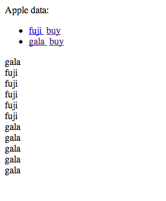
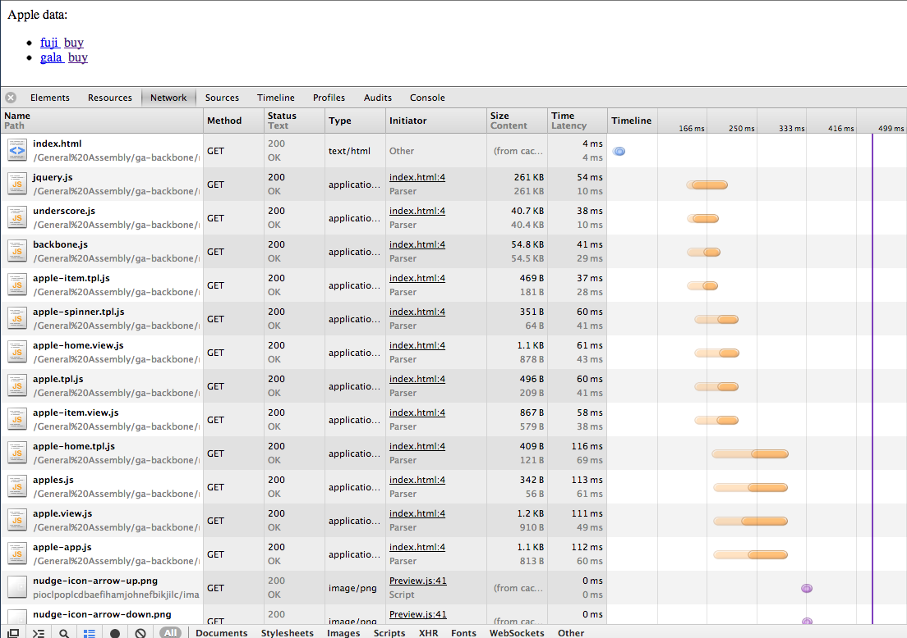
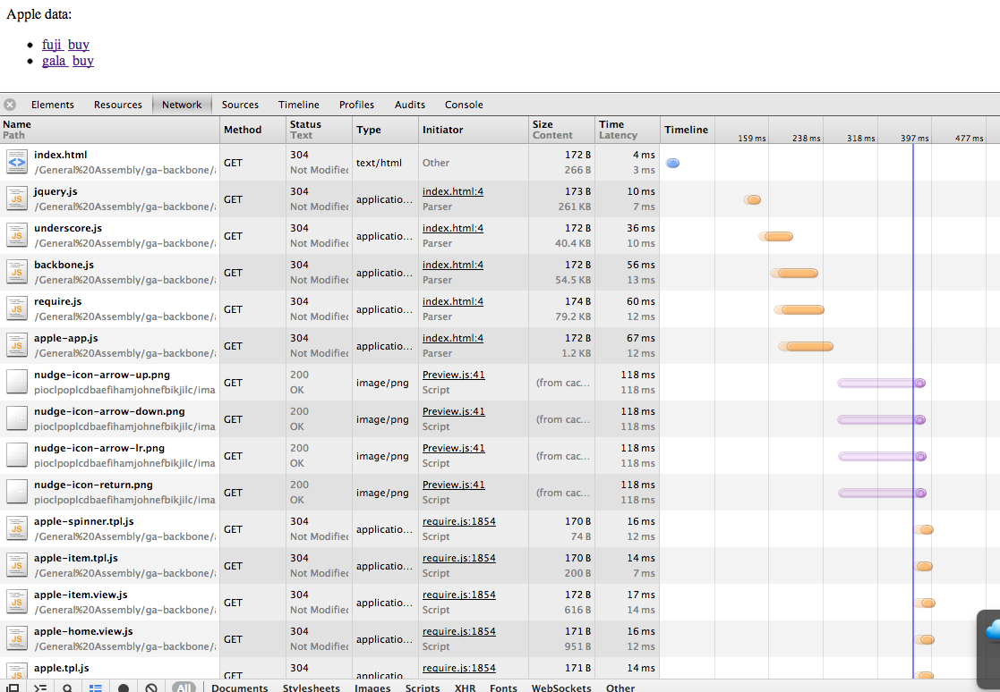
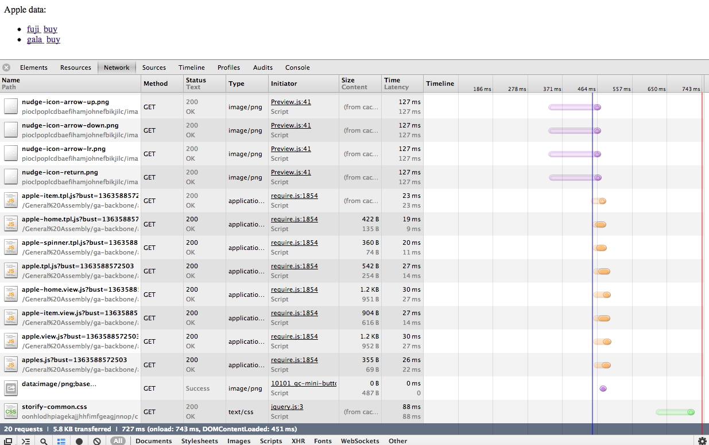
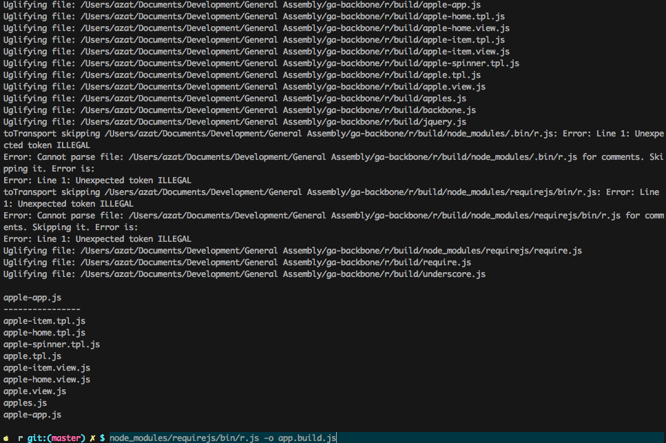

Chapter 4
=========

Intro to Backbone.js
====================

> *Code is not an asset. It's a liability. The more you write, the more
> you'll have to maintain later.*
>
> — Unknown

This chapter will demonstrate:

-   Setting up a Backbone.js app from scratch and installing
    dependencies

-   Working with Backbone.js collections

-   Backbone.js event binding

-   Backbone.js views and subviews with Underscore.js

-   Refactoring Backbone.js code

-   AMD and Require.js for Backbone.js development

-   Require.js for Backbone.js production

-   A simple Backbone.js starter kit

Backbone.js has been around for a while so it's very mature and can be
trusted to be used in serious front-end development projects. This
framework is decidedly minimalistic and unopinionated. You can use
Backbone.js with a lot of other libraries and modules. I think of
Backbone.js as the foundation to build a custom framework that will be
tightly suited to your particular use case.

Some people are turned off by the fact that Backbone.js is unopinionated
and minimalistic. They prefer frameworks that do more for them and
enforce a particular way of doing things (e.g., [the Angular best
practices](https://github.com/johnpapa/angular-styleguide)
(https://github.com/johnpapa/angular-styleguide)). This is totally fine
with me, and you can pursue the study of a more complex front-end
framework. They all fit nicely into the Node.js stack and the ecosystem.
For the purpose of this book, Backbone.js is ideal because it provides
some much needed sanity to the plain nonframework jQuery code, and at
the same time it doesn't have a steep learning curve. All you need to
know is a few classes and methods, which we cover in this book.
Everything else is JavaScript, not a domain-specific language.

Setting Up Backbone.js App from Scratch
=======================================

We're going to build a
typical starter Hello World application using Backbone.js and
Mode-View-Controller (MVC) architecture. It might sound like overkill in
the beginning, but as we go along we'll add more and more complexity,
including models, subviews, and collections.

Full source code for the Hello World app is available under
`05``-backbone/hello-world` and on
[GitHub](https://github.com/azat-co/fullstack-javascript/tree/master/05-backbone/hello-world)
(https://github.com/azat-co/fullstack-javascript/tree/master/05-backbone/hello-world).

Backbone.js Dependencies
------------------------

Supplemental
video which walks you through the implementation and demonstrates the
project: <http://bit.ly/1O7xRCY>.

Download the following libraries:

-   jQuery v2.1.4 development source file
    <http://code.jquery.com/jquery-2.1.4.js>

-   Underscore.js v1.8.3 development source file
    <http://underscorejs.org/underscore.js>

-   Backbone.js v1.2.3 development source file
    <http://backbonejs.org/backbone.js>

Obviously by the time this book is in print, these versions won't be the most recent. I recommend sticking with the versions in this book, because that's what I used to test all the examples and projects. Using different, newer versions might cause some unexpected conflicts.

Create an `index.html` file, and include these frameworks in this file
like this:

    <!DOCTYPE>
    <html>
    <head>
      
      
      

      

    </head>
    <body>
    </body>
    </html>

We can also put `
      
      

      
    </head>
    <body>
      

    </body>
    </html>

Open `collections/index.html` file in your browser. You should see the
data from our database; that is,
`Apple data: [{"name":"fuji","url":"img/fuji.jpg"}``,{``"name":"gala","url":"img/gala.jpg"}]`.

Now, let' go to `collections/``index.html#apples/``fuji` or
`collections/``index.html#apples/gala` in your browser. We expect to
see an image with a caption. It's a detailed view of an item, which in
this case is an apple. Nice work!

Backbone.js Event Binding
==================================================================================================================================

Supplemental video which walks you through
the implementation and demonstrates the project: <http://bit.ly/1k0ZnUB>.

In real life, getting data does not happen instantaneously, so let's
refactor our code to simulate it. For a better user experience (UX),
we'll also have to show a loading icon (a spinner or ajax-loader) to
users to notify them that the information is being loaded.

It's a good thing that we have event binding in Backbone. Without it, we
would have to pass a function that renders HTML as a callback to the
data loading function, to make sure that the rendering function is not
executed before we have the actual data to display.

Therefore, when a user goes to detailed view (`apples/``:id`) we only
call the function that loads the data. Then, with the proper event
listeners, our view will automagically (this is not a typo) update
itself when there is new data (or on a data change; Backbone.js supports
multiple and even custom events).

For your information, if you don't feel like typing out the code (which
I recommend), it's in `05``-backbone/binding` and
[GitHub](https://github.com/azat-co/fullstack-javascript/blob/master/5-backbone/binding/index.html)
(https://github.com/azat-co/fullstack-javascript/blob/master/05-backbone/binding/index.html).

Let's change the code in the router:

      ...
        loadApple: function(appleName){
          this.appleView.loadApple(appleName)
        }
      ...

Everything else remains the same until we get to the `appleView` class.
We'll need to add a constructor or an `initialize` method, which is a
special word or property in the Backbone.js framework. It's called each
time we create an instance of an object, such as
`var`` ``someObj`` = new ``SomeObject()`. We can also pass extra
parameters to the `initialize` function, as we did with our views (we
passed an object with the key `collection` and the value of `apples`
Backbone Collection). Read more on Backbone.js constructors at
[`backbonejs.org/#View-constructor`](http://backbonejs.org/#View-constructor).

      ...
      var appleView = Backbone.View.extend({
        initialize: function(){
          // TODO: create and setup model (aka an apple)
        },
      ...

We have our `initialize` function; now we need to create a model that
will represent a single apple and set up proper event listeners on the
model. We'll use two types of events, `change` and a custom event called
`spinner`. To do that, we are going to use the `on(``)` function, which
takes these properties: `on(event, actions, context)``.` You can read
more about it at
[`backbonejs.org/#Events-on`](http://backbonejs.org/#Events-on).

      ...
      var appleView = Backbone.View.extend({
        initialize: function(){
          this.model = new (Backbone.Model.extend({}))
          this.model.bind('change', this.render, this)
          this.bind('spinner', this.showSpinner, this)
        },
        ...
      })
      ...

The preceding code basically boils down to two simple things:

1.  Call the `render(``)` function of the `appleView` object when the
    model has changed.

2.  Call the `showSpinner()` method of the `appleView` object when
    event `spinner` has been fired.

So far, so good, right? But what about the spinner, a GIF icon? Let's
create a new property in `appleView`:

      ...
        templateSpinner: '',
      ...

Remember the `loadApple` call in the router? This is how we can
implement the function in `appleView`:

      ...
      loadApple:function(appleName){

To show the spinner GIF image, use `this.trigger` to make Backbone call
the `showSpinner`:

        this.trigger('spinner')

Next, we'll need to access the context inside of a closure. Sometimes I
like to use a meaningful name instead of `_this` or `self`, so:

        var view = this

Next, you would have an XHR call (e.g., `$.ajax()`) to the server
to get the data. We'll simulate the real time lag when fetching data
from the remote server with:

        setTimeout(function(){
          view.model.set(view.collection.where({
            name:appleName
          })[0].attributes)
        }, 1000)
      },
      ...

The `attributes` is a Backbone.js model property that gives a normal
JavaScript object with the model's properties. To summarize, the first
line will trigger the `spinner` event (the function for which we still
have to write). The second line is just for scoping issues (so we can
use `appleView` inside of the closure).

The `setTimeout` function is simulating a time lag of a real remote
server response. Inside of it, we assign attributes of a selected model
to our view's model by using a `model.set()` function and a
`model.attributes` property (which returns the properties of a model).

Now we can remove an extra code from the `render` method and implement
the `showSpinner` function:

      render: function(appleName){
        var appleHtml = this.template(this.model)
        $('body').html(appleHtml)
      },
      showSpinner: function(){
        $('body').html(this.templateSpinner)
      }
      ...

That's all! Open `index.html#apples/gala` or
`index.html#apples/fuji` in your browser and enjoy the loading
animation while waiting for an apple image to load.

Here is the full code of the `index.html` file (also in
`05-backbone/binding/index.html` and
<https://github.com/azat-co/fullstack-javascript/blob/master/5-backbone/binding/index.html>):

    <!DOCTYPE>
    <html>
    <head>
      
      
      

      
    </head>
    <body>
      

    </body>
    </html>

Backbone.js Views and Subviews with Underscore.js
=================================================

Supplemental video which walks you through the implementation and
demonstrates the project: <http://bit.ly/1k0ZnUB>. And this example i>s
available at
<https://github.com/azat-co/fullstack-javascript/tree/master/05-backbone/subview>.

Subviews are Backbone Views that are created and used inside of another
Backbone View. A subviews concept is a great way to abstract (separate)
UI events (e.g., clicks), and templates for similarly structured
elements (e.g., apples).

A use case of a Subview might include a row in a table, an item in a
list, a paragraph, or a new line.

We'll refactor our home page to show a nice list of apples. Each list
item will have an apple name and a Buy link with an `onClick` event.
Let's start by creating a subview for a single apple with our standard
Backbone `extend(``)` function:

      ...
      var appleItemView = Backbone.View.extend({
        tagName: 'li',
        template: _.template(''
               +'<a href="#apples/<%=name%>" target="_blank">'
              +'<%=name%>'
              +'</a>&nbsp;<a class="add-to-cart" href="#">buy</a>'),
        events: {
          'click .add-to-cart': 'addToCart'
        },
        render: function() {
          this.$el.html(this.template(this.model.attributes))
        },
        addToCart: function(){
          this.model.collection.trigger('addToCart', this.model)
        }
      })
      ...

Now we can populate the object with `tagName`, `template`, `events`,
`render`, and `addToCart` properties and methods.

      ...
      tagName: 'li',
      ...

`tagName` automatically allows Backbone.js to create an HTML
element with the specified tag name, in this case `<``li``>` for list
item. This will be a representation of a single apple, a row in our
list.

      ...
      template: _.template(''
             +'<a href="#apples/<%=name%>" target="_blank">'
            +'<%=name%>'
            +'</a>&nbsp;<a class="add-to-cart" href="#">buy</a>'),
      ...

The template is just a string with Underscore.js instructions. They are
wrapped in `<%` and `%>` symbols. `<%=` simply means print a value. The
same code can be written with backslash escapes:

      ...
      template: _.template('\
             <a href="#apples/<%=name%>" target="_blank">\
            <%=name%>\
            </a>&nbsp;<a class="add-to-cart" href="#">buy</a>\
            '),
      ...

Each `<``li``>` will have two anchor elements (`<a>`), links to a
detailed apple view (`#apples/``:``appleName`), and a Buy button. Now
we're going to attach an event listener to the Buy button:

      ...
      events: {
        'click .add-to-cart': 'addToCart'
      },
      ...

The syntax follows this rule:

    event + jQuery element selector: function name

Both the key and the value (right and left parts separated by the colon)
are strings. For example:

    'click .add-to-cart': 'addToCart'

or

    'click #load-more': 'loadMoreData'

To render each item in the list, we'll use the jQuery `html(``)`
function on the `this.$el` jQuery object, which is the `<``li``>` HTML
element based on our `tagName` attribute:

      ...
      render: function() {
        this.$el.html(this.template(this.model.attributes))
      },
      ...

`addToCart` will use the `trigger()` function to notify the collection
that this particular model (apple) is up for the purchase by the user:

      ...
        addToCart: function(){
          this.model.collection.trigger('addToCart', this.model)
        }
      ...

Here is the full code of the `appleItemView` Backbone View class:

      ...
      var appleItemView = Backbone.View.extend({
        tagName: 'li',
        template: _.template(''
               + '<a href="#apples/<%=name%>" target="_blank">'
              + '<%=name%>'
              + '</a>&nbsp;<a class="add-to-cart" href="#">buy</a>'),
        events: {
          'click .add-to-cart': 'addToCart'
        },
        render: function() {
          this.$el.html(this.template(this.model.attributes))
        },
        addToCart: function(){
          this.model.collection.trigger('addToCart', this.model)
        }
      })
      ...

Easy peasy! But what about the master view, which is supposed to render
all of our items (apples) and provide a wrapper `<``ul``>` container for
`li` HTML elements? We need to modify and enhance our `homeView`.

To begin with, we can add extra properties of `string` type
understandable by jQuery as selectors to `homeView`:

      ...
      el: 'body',
      listEl: '.apples-list',
      cartEl: '.cart-box',
      ...

We can use properties from earlier in the template, or just hard-code
them (we'll refactor our code later) in `homeView`:

      ...
      template: _.template('Apple data: \
        <ul class="apples-list">\
        </ul>\
        

'),
      ...

The `initialize` function will be called when `homeView` is created
(`new ``homeView()`). There we render our template (with our
favorite `html(``)` function), and attach an event listener to the
collection, which is a set of apple models:

      ...
        initialize: function() {
          this.$el.html(this.template)
          this.collection.on('addToCart', this.showCart, this)
        },
      ...

The syntax for the binding event is covered in the previous section. In
essence, it is calling the `showCart()` function of `homeView`. In
this function, we append `appleName` to the cart (along with a line
break, a `<``br/>` element):

      ...
        showCart: function(appleModel) {
          $(this.cartEl).append(appleModel.attributes.name + ' ')
        },
      ...

Finally, here is our long-awaited `render(``)` method, in which we
iterate through each model in the collection (each apple), create an
`appleItemView` for each apple, create an `<``li``>` element for each
apple, and append that element to `view.listEl` — `<``ul``>` element
with a class `apples-list` in the DOM:

      ...
      render: function(){
        view = this
        // So we can use view inside of closure
        this.collection.each(function(apple){
          var appleSubView = new appleItemView({model:apple})
          // Creates subview with model apple
          appleSubView.render()
          // Compiles template and single apple data
          $(view.listEl).append(appleSubView.$el)
          // Append jQuery object from single
          // Apple to apples-list DOM element
        })
      }
      ...

Let's make sure we didn't miss anything in the `homeView` Backbone
View. Here's the full code sans the inline comments:

      ...
      var homeView = Backbone.View.extend({
        el: 'body',
        listEl: '.apples-list',
        cartEl: '.cart-box',
        template: _.template('Apple data: \
          <ul class="apples-list">\
          </ul>\
          

'),
        initialize: function() {
          this.$el.html(this.template)
          this.collection.on('addToCart', this.showCart, this)
        },
        showCart: function(appleModel) {
          $(this.cartEl).append(appleModel.attributes.name + ' ')
        },
        render: function(){
          view = this
          this.collection.each(function(apple){
            var appleSubView = new appleItemView({model: apple})
            appleSubView.render()
            $(view.listEl).append(appleSubView.$el)
          })
        }
      })
      ... 

You should be able to click the Buy button and populate the cart with
the apples of your choice. Looking at an individual apple does not
require typing its name in the URL address bar of the browser anymore.
We can click the name to open a new window with a detailed view.

By using subviews, we reused the template for all of the items (apples)
and attached a specific event to each of them (see Figure 4-1). Those
events are smart enough to pass the information about the model to other
objects: views and collections.

***Figure 4-1.*** *The list of apples rendered by subviews*

Just in case, here is the full code for the subviews example, which is
also available at
https://github.com/azat-co/fullstack-javascript/blob/master/05-backbone/subview/index.html:

    <!DOCTYPE>
    <html>
    <head>
      
      
      

      
    </head>
    <body>
      

    </body>
    </html>

The link to an individual item, for example,
`collections/``index.html#apples/``fuji`, also should work
independently, by typing it in the browser address bar.

Refactoring Backbone.js Code
=======================================================================================================================================

Supplemental video which walks you through the implementation and
demonstrates the project: <http://bit.ly/1k0ZnUB>.

At this point you are probably wondering what the benefit is of using
the framework and still having multiple classes, objects, and elements
with different functionalities in one single file. This was done for the
purpose of adhering to the idea of keeping things simple.

The bigger your application is, the more pain there is in an unorganized
code base. Let's break down our application into multiple files where
each file will be one of these types:

-   View

-   Template

-   Router

-   Collection

-   Model

Let's write these scripts to include tags into our `index.html` head, or
body, as noted previously:

      
      
      
      
      

The names don't have to follow the convention of dashes and dots, as
long as it's easy to tell what each file is supposed to do.

Now, let's copy our objects and classes into the corresponding files.

Our main `index.html` file should look very minimalistic:

    <!DOCTYPE>
    <html>
    <head>
      
      
      

      
      
      
      
      

    </head>
    <body>
      

    </body>
    </html>

The other files just have the code that corresponds to their file names.

The content of `apple-``item.view.js` will have the `appleView` object:

      var appleView = Backbone.View.extend({
        initialize: function(){
          this.model = new (Backbone.Model.extend({}))
          this.model.on('change', this.render, this)
          this.on('spinner', this.showSpinner, this)
        },
        template: _.template('<figure>\
                  "/>\
                  <figcaption><%= attributes.name %></figcaption>\
                </figure>'),
        templateSpinner: '',

        loadApple:function(appleName){
          this.trigger('spinner')
          var view = this
          // We'll need to access that inside of a closure
          setTimeout(function(){
          // Simulates real time lag when fetching
          // data from the remote server
            view.model.set(view.collection.where({
              name: appleName
            })[0].attributes)
          }, 1000)
        },

        render: function(appleName){
          var appleHtml = this.template(this.model)
          $('body').html(appleHtml)
        },
        showSpinner: function(){
          $('body').html(this.templateSpinner)
        }
      })

The `apple-``home.view.js` file has the `homeView` object:

      var homeView = Backbone.View.extend({
        el: 'body',
        listEl: '.apples-list',
        cartEl: '.cart-box',
        template: _.template('Apple data: \
          <ul class="apples-list">\
          </ul>\
          

'),
        initialize: function() {
          this.$el.html(this.template)
          this.collection.on('addToCart', this.showCart, this)
        },
        showCart: function(appleModel) {
          $(this.cartEl).append(appleModel.attributes.name + ' ')
        },
        render: function(){
          view = this // So we can use view inside of closure
          this.collection.each(function(apple){
            var appleSubView = new appleItemView({model:apple})
            // Create subview with model apple
            appleSubView.render()
            // Compiles template and single apple data
            $(view.listEl).append(appleSubView.$el)
            // Append jQuery object from
            // single apple to apples-list DOM element
          })
        }
      })

The `apple.view.js` file contains the master apples list:

      var appleView = Backbone.View.extend({
        initialize: function(){
          this.model = new (Backbone.Model.extend({}))
          this.model.on('change', this.render, this)
          this.on('spinner',this.showSpinner, this)
        },
        template: _.template('<figure>\
                "/>\
                <figcaption><%= attributes.name %></figcaption>\
              </figure>'),
        templateSpinner: '',
        loadApple:function(appleName){
          this.trigger('spinner')
          var view = this
          // We'll need to access that inside of a closure
          setTimeout(function(){
          // Simulates real time lag when
          // fetching data from the remote server
            view.model.set(view.collection.where({
              name:appleName
            })[0].attributes)
          }, 1000)
        },
        render: function(appleName){
          var appleHtml = this.template(this.model)
          $('body').html(appleHtml)
        },
        showSpinner: function(){
          $('body').html(this.templateSpinner)
        }
      })

`apples.js` is an empty collection:

        var Apples = Backbone.Collection.extend({
        })

`apple-app.js` is the main application file with the data, the router,
and the starting command:

       var appleData = [
          {
            name: 'fuji',
            url: 'img/fuji.jpg'
          },
          {
            name: 'gala',
            url: 'img/gala.jpg'
          }
        ]
        var app
        var router = Backbone.Router.extend({
          routes: {
            '': 'home',
            'apples/:appleName': 'loadApple'
          },
          initialize: function(){
            var apples = new Apples()
            apples.reset(appleData)
            this.homeView = new homeView({collection: apples})
            this.appleView = new appleView({collection: apples})
          },
          home: function(){
            this.homeView.render()
          },
          loadApple: function(appleName){
            this.appleView.loadApple(appleName)
          }
        })
        $(document).ready(function(){
          app = new router
          Backbone.history.start()
        })

Now let's try to open the application. It should work exactly the same
as in the previous Subviews example.

It's a far better code organization, but it's still far from perfect,
because we still have HTML templates directly in the JavaScript code.
The problem is that designers and developers can't work on the same
files, and any change to the presentation requires a change in the main
code base.

We can add a few more JS files to our `index.html` file:

      
      
      
      

Usually, one Backbone View has one template, but in the case of our
`appleView`—a detailed view of an apple in a separate window—we also
have a spinner, a "loading" GIF animation.

The contents of the files are just global variables that are assigned
some string values. Later we can use these variables in our views, when
we call the Underscore.js helper method `_.``template(``)`.

Here is the `apple-``item.tpl.js` file:

    var appleItemTpl = '\
         <a href="#apples/<%=name%>" target="_blank">\
        <%=name%>\
        </a>&nbsp;<a class="add-to-cart" href="#">buy</a>\
        '

This is the `apple-``home.tpl.js` file:

    var appleHomeTpl = 'Apple data: \
            <ul class="apples-list">\
            </ul>\
            

'

Here is the `apple-``spinner.tpl.js` file:

    var appleSpinnerTpl = ''

This is the `apple.tpl.js` file:

    var appleTpl = '<figure>\
                    "/>\
                    <figcaption><%= attributes.name %></figcaption>\
                  </figure>'

Try to start the application now. The full code is at
https://github.com/azat-co/fullstack-javascript/tree/master/05-backbone/refactor.

As you can see in the previous example, we used global scoped variables
(without the keyword `window`).

Be careful when you introduce a lot of variables into the global
namespace (`window` keyword). There might be conflicts and other
unpredictable consequences. For example, if you wrote an open source
library and other developers started using the methods and properties
directly, instead of using the interface, what would happen later when
you decide to finally remove or deprecate those global leaks? To prevent
this, properly written libraries and applications use [JavaScript
closures](https://developer.mozilla.org/en-US/docs/JavaScript/Guide/Closures)
(https://developer.mozilla.org/en-US/docs/Web/JavaScript/Closures).

Here is an example of using closure and a global variable module
definition:

    ;(function() {
      var apple= function() {
      ...// Do something useful like return apple object
      }
      window.Apple = apple
    }())

In a case when we need to access the app object (which creates a
dependency on that object):

    ;(function() {
      var app = this.app
      // Equivalent of window.appliation
      // in case we need a dependency (app)
      this.apple = function() {
        ...
        // Return apple object/class
        // Use app variable
      }
      // Equivalent of window.apple = function(){...}
    }())

As you can see, we've created the function and called it immediately
while also wrapping everything in parentheses `()`.

AMD and Require.js for Backbone.js Development
==============================================

Supplemental video which walks you through the implementation and
demonstrates the project: <http://bit.ly/1k0ZnUB>.

AMD allows us to organize development code into modules, manage
dependencies, and load them asynchronously. This article does a great
job at explaining why AMD is a good thing: [WHY
AMD?](http://requirejs.org/docs/whyamd.html)

Start your local HTTP server, for example,
[MAMP](https://www.mamp.info/en) (https://www.mamp.info/en ) or
node-static ( https://github.com/cloudhead/node-static ).

Let's enhance our code by using the Require.js library.

Our `index.html` will shrink even more:

    <!DOCTYPE>
    <html>
    <head>
      
      
      
      
      
    </head>
    <body>
      

    </body>
    </html>

We only included libraries and the single JavaScript file with our
application. This file has the following structure:

    require([...],function(...){...})

In a more explanatory way:

    require([
      'name-of-the-module',
      ...
      'name-of-the-other-module'
      ],function(referenceToModule, ..., referenceToOtherModule){
      ...// Some useful code
      referenceToModule.someMethod()
    })

Basically, we tell a browser to load the files from the array of file
names—the first parameter of the `require(``)` function—and then pass
our modules from those files to the anonymous callback function (second
argument) as variables. Inside of the main function (anonymous callback)
we can use our modules by referencing those variables. Therefore, our
`apple-app.js` metamorphoses into:

      require([
        'apple-item.tpl', // Can use shim plug-in
        'apple-home.tpl',
        'apple-spinner.tpl',
        'apple.tpl',
        'apple-item.view',
        'apple-home.view',
        'apple.view',
        'apples'
      ],function(
        appleItemTpl,
        appleHomeTpl,
        appleSpinnerTpl,
        appleTpl,
        appelItemView,
        homeView,
        appleView,
        Apples
        ){
       var appleData = [
          {
            name: 'fuji',
            url: 'img/fuji.jpg'
          },
          {
            name: 'gala',
            url: 'img/gala.jpg'
          }
        ]
        var app
        var router = Backbone.Router.extend({
        // Check if need to be required
          routes: {
            '': 'home',
            'apples/:appleName': 'loadApple'
          },
          initialize: function(){
            var apples = new Apples()
            apples.reset(appleData)
            this.homeView = new homeView({collection: apples})
            this.appleView = new appleView({collection: apples})
          },
          home: function(){
            this.homeView.render()
          },
          loadApple: function(appleName){
            this.appleView.loadApple(appleName)
          }
        })

        $(document).ready(function(){
          app = new router
          Backbone.history.start()
        })
    })

We put all of the code inside the function that is a second argument of
`require(``)`, mentioned modules by their file names, and used
dependencies via corresponding parameters. Now we should define the
module itself. This is how we can do it with the `define(``)` method:

    define([...],function(...){...})

The meaning is similar to the `require(``)` function: Dependencies are
strings of file names (and paths) in the array that is passed as the
first argument. The second argument is the main function that accepts
other libraries as parameters (the order of parameters and modules in
the array is important):

    define(['name-of-the-module'],function(nameOfModule){
      var b = nameOfModule.render()
      return b
    })

Note that there is no need to append `.``js` to file names. Require.js
does it automatically. The Shim plug-in is used for importing text files
such as HTML templates.

Let's start with the templates and convert them into the Require.js
modules.

Here is the new `apple-``item.tpl.js` file:

    define(function() {
      return '\
                 <a href="#apples/<%=name%>" target="_blank">\
                <%=name%>\
                </a>&nbsp;<a class="add-to-cart" href="#">buy</a>\
                '
    })

This is the `apple-home.tpl` file:

    define(function(){
      return 'Apple data: \
            <ul class="apples-list">\
            </ul>\
            

'
    })

Here is the `apple-``spinner.tpl.js` file:

    define(function(){
      return ''
    })

This is the `apple.tpl.js` file:

    define(function(){
      return '<figure>\
              "/>\
              <figcaption><%= attributes.name %></figcaption>\
            </figure>'
     })

Here is the `apple-``item.view.js` file:

    define(function() {
      return '\
                 <a href="#apples/<%=name%>" target="_blank">\
                <%=name%>\
                </a>&nbsp;<a class="add-to-cart" href="#">buy</a>\
                '
    })

In the `apple-``home.view.js` file, we need to declare dependencies on
`apple-home.tpl` and `apple-``item.view.js` files:

    define(['apple-home.tpl', 'apple-item.view'], function(
      appleHomeTpl,
      appleItemView){
    return  Backbone.View.extend({
          el: 'body',
          listEl: '.apples-list',
          cartEl: '.cart-box',
          template: _.template(appleHomeTpl),
          initialize: function() {
            this.$el.html(this.template)
            this.collection.on('addToCart', this.showCart, this)
          },
          showCart: function(appleModel) {
            $(this.cartEl).append(appleModel.attributes.name + ' ')
          },
          render: function(){
            view = this // So we can use view inside of closure
            this.collection.each(function(apple){
              var appleSubView = new appleItemView({model:apple})
              // Create subview with model apple
              appleSubView.render()
              // Compiles template and single apple data
              $(view.listEl).append(appleSubView.$el)
              // Append jQuery object from
              // a single apple to apples-list DOM element
            })
          }
        })
    })

The `apple.view.js` file depends on two templates:

    define([
      'apple.tpl',
      'apple-spinner.tpl'
    ], function(appleTpl,appleSpinnerTpl){
      return  Backbone.View.extend({
        initialize: function(){
          this.model = new (Backbone.Model.extend({}))
          this.model.on('change', this.render, this)
          this.on('spinner',this.showSpinner, this)
        },
        template: _.template(appleTpl),
        templateSpinner: appleSpinnerTpl,
        loadApple:function(appleName){
          this.trigger('spinner')
          var view = this
          // We'll need to access that inside of a closure
          setTimeout(function(){
          // Simulates real time lag when
          // fetching data from the remote server
            view.model.set(view.collection.where({
              name:appleName
            })[0].attributes)
          }, 1000)
        },
        render: function(appleName){
          var appleHtml = this.template(this.model)
          $('body').html(appleHtml)
        },
        showSpinner: function(){
          $('body').html(this.templateSpinner)
        }
      })
    })

This is the `apples.js` file:

    define(function(){
      return Backbone.Collection.extend({})
    })

I hope you can see the pattern by now. All of our code is split into the
separate files based on the logic (e.g., view class, collection class,
template). The main file loads all of the dependencies with the
`require(``)` function. If we need some module in a nonmain file, then
we can ask for it in the `define(``)` method. Usually, in modules we
want to return an object; for example, in templates we return strings
and in views we return Backbone View classes and objects.

Try launching the example located at
https://github.com/azat-co/fullstack-javascript/blob/master/05-backbone/amd/.
Visually, there shouldn't be any changes. If you open the Network tab in
the Developers Tool, you can see a difference in how the files are
loaded.

The old file shown in Figure 4-2
(https://github.com/azat-co/fullstack-javascript/tree/master/05-backbone/refactor/index.html)
loads our JavaScript scripts in a serial manner, whereas the new file
shown in Figure 4-3
(https://github.com/azat-co/fullstack-javascript/blob/master/05-backbone/amd/index.html)
loads them in parallel.

***Figure 4-2.*** *The old 05-backbone/refactor/index.html file*

***Figure 4-3.*** *The new 05-backbone/amd/index.html file*

Require.js has a lot of configuration options that are defined through
the `requirejs.config()` call in the top level of an HTML page. More
information can be found at
[`requirejs.org/docs/``api.html#config`](http://requirejs.org/docs/api.html#config).

Let's add a bust parameter to our example. The bust argument will be
appended to the URL of each file, preventing a browser from caching the
files. This is perfect for development and terrible for production.

Add this to the `apple-app.js` file in front of everything else:

    requirejs.config({
      urlArgs: 'bust=' +  (new Date()).getTime()
    })
    require([
    ...

Notice in Figure 4-4 that each file request now has status 200 instead
of 304 (not modified).

***Figure 4-4.*** *Network tab with bust parameter added*

Require.js for Backbone.js Production
=====================================

We'll use the Node Package
Manager (NPM) to install the `requirejs` library (it's not a typo;
there's no period in the name). In your project folder, run this command
in a terminal:

    $ npm init

Then run

    $ npm install requirejs

or add `-g` for global installation:

    $ npm install -g requirejs

Create a file named `app.build.js`:

    ({
        appDir: "./js",
        baseUrl: "./",
        dir: "build",
        modules: [
            {
                name: "apple-app"
            }
        ]
    })

Move the script files into the `js` folder (`appDir` property). The
builded files will be placed in the `build` folder (`dir` parameter).
For more information on the build file, check out the extensive example
with comments available at
[`https://github.com/jrburke/r.js/blob/master/build/example.build.js`](https://github.com/jrburke/r.js/blob/master/build/example.build.js).

Now everything should be ready for building one gigantic JavaScript file
that will include all of our dependencies and modules:

    $ r.js -o app.build.js

or

    $ node_modules/requirejs/bin/r.js -o app.build.js

You should get a list of the r.js processed files, as shown in Figure
4-5.

***Figure 4-5.*** *A list of the r.js processed files*

Open `index.html` from the build folder in a browser window, and check
if the Network tab shows any improvement now with just one request or
file to load (Figure 4-6).

***Figure 4-6.*** *Performance improvement with one request or file to load*

For more information, check out the official r.js documentation at
[`requirejs.org/docs/optimization.html`](http://requirejs.org/docs/optimization.html).

The example code is available at
https://github.com/azat-co/fullstack-javascript/tree/master/05-backbone/r

and
https://github.com/azat-co/fullstack-javascript/tree/master/05-backbone/r/build.

For uglification of JS files (which decreases the file sizes), we can
use the [Uglify2](https://github.com/mishoo/UglifyJS2) module. To
install it with NPM, use:

    $ npm install uglify-js

Then update the `app.build.js` file with the `optimize``: "uglify2"`
property:

    ({
        appDir: "./js",
        baseUrl: "./",
        dir: "build",
        optimize: "uglify2",
        modules: [
            {
                name: "apple-app"
            }
        ]
    })

Run r.js with:

    $ node_modules/requirejs/bin/r.js -o app.build.js

You should get something like this:

    define("apple-item.tpl",[],function(){return'             <a href="#apples/<%=name%>" target="_blank">            <%=name%>            </a>&nbsp;<a class="add-to-cart" href="#">buy</a>            '}),define("apple-home.tpl",[],function(){return'Apple data:         <ul class="apples-list">        </ul>        

'}),define("apple-spinner.tpl",[],function(){return''}),define("apple.tpl",[],function(){return'<figure>                              "/>                              <figcaption><%= attributes.name %></figcaption>                            </figure>'}),define("apple-item.view",["apple-item.tpl"],function(e){return Backbone.View.extend({tagName:"li",template:_.template(e),events:{"click .add-to-cart":"addToCart"},render:function(){this.$el.html(this.template(this.model.attributes))},addToCart:function(){this.model.collection.trigger("addToCart",this.model)}})}),define("apple-home.view",["apple-home.tpl","apple-item.view"],function(e,t){return Backbone.View.extend({el:"body",listEl:".apples-list",cartEl:".cart-box",template:_.template(e),initialize:function(){this.$el.html(this.template),this.collection.on("addToCart",this.showCart,this)},showCart:function(e){$(this.cartEl).append(e.attributes.name+" ")},render:function(){view=this,this.collection.each(function(e){var i=new t({model:e});i.render(),$(view.listEl).append(i.$el)})}})}),define("apple.view",["apple.tpl","apple-spinner.tpl"],function(e,t){return Backbone.View.extend({initialize:function(){this.model=new(Backbone.Model.extend({})),this.model.on("change",this.render,this),this.on("spinner",this.showSpinner,this)},template:_.template(e),templateSpinner:t,loadApple:function(e){this.trigger("spinner");var t=this;setTimeout(function(){t.model.set(t.collection.where({name:e})[0].attributes)},1e3)},render:function(){var e=this.template(this.model);$("body").html(e)},showSpinner:function(){$("body").html(this.templateSpinner)}})}),define("apples",[],function(){return Backbone.Collection.extend({})}),requirejs.config({urlArgs:"bust="+(new Date).getTime()}),require(["apple-item.tpl","apple-home.tpl","apple-spinner.tpl","apple.tpl","apple-item.view","apple-home.view","apple.view","apples"],function(e,t,i,n,a,l,p,o){var r,s=[{name:"fuji",url:"img/fuji.jpg"},{name:"gala",url:"img/gala.jpg"}],c=Backbone.Router.extend({routes:{"":"home","apples/:appleName":"loadApple"},initialize:function(){var e=new o;e.reset(s),this.homeView=new l({collection:e}),this.appleView=new p({collection:e})},home:function(){this.homeView.render()},loadApple:function(e){this.appleView.loadApple(e)}});$(document).ready(function(){r=new c,Backbone.history.start()})}),define("apple-app",function(){});

The file is intentionally not formatted to show how Uglify2
(https://github.com/mishoo/UglifyJS2 ) works. Without the line break
escape symbols, the code is on one line. Also notice that variables’ and
objects’ names are shortened.

Super Simple Backbone.js Starter Kit
====================================

To jump-start your Backbone.js development, consider using [Super Simple
Backbone Starter
Kit](https://github.com/azat-co/super-simple-backbone-starter-kit)
(<https://github.com/azat-co/super-simple-backbone-starter-kit>) or
similar projects:

-   [Backbone Boilerplate](http://backboneboilerplate.com/) available at
    <http://backboneboilerplate.com>

-   [Sample App with Backbone.js and Twitter
    Bootstrap](http://coenraets.org/blog/2012/02/sample-app-with-backbone-js-and-twitter-bootstrap/)
    available at
    <http://coenraets.org/blog/2012/02/sample-app-with-backbone-js-and-twitter-bootstrap>

-   More Backbone.js tutorials available at
    [`github.com/documentcloud/backbone/wiki/Tutorials%2C-blog-posts-and-example-sites`](https://github.com/documentcloud/backbone/wiki/Tutorials%2C-blog-posts-and-example-sites)

Summary
=======

So far we've covered how to:

-   Build a Backbone.js application from scratch.

-   Use views, collections, subviews, models, and event binding.

-   Use AMD and Require.js on the example of the apple
    database application.

In this chapter, you've learned enough about Backbone.js to make sure
you can start using it in your web or mobile apps. Without a framework
like Backbone, your code will become exponentially more complex as it
grows. On the other hand, with Backbone or a similar MVC, you can scale
the code better.
