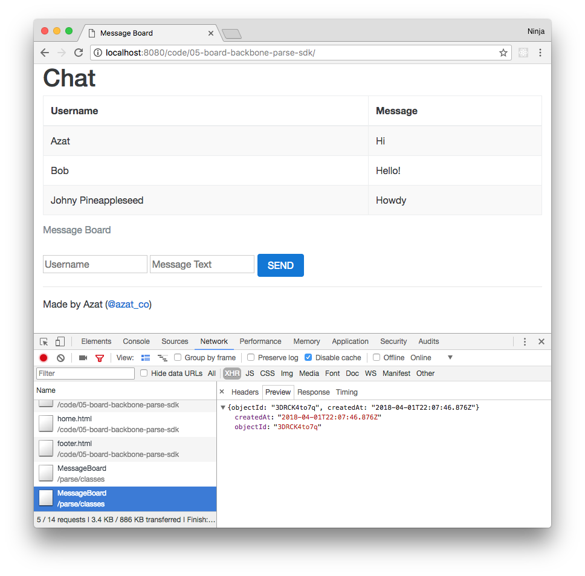

<span id="backbone.js-and-Parse" class="anchor"></span>

CHAPTER 5
---------

Backbone.js and Parse
=========================
> *When in doubt—console log.*
>
> — [Azat Mardan](http://azat.co)

In this chapter, we'll explore the practical aspect of leveraging Parse for a Backbone.js app. The chapter will illustrate the following:

* Backbone.js and Parse usage
* Modifying Message Board with Parse and JavaScript SDK
* Taking Message Board further the

If you've written some complex client-side applications, you might have found that it's challenging to maintain the spaghetti code of JavaScript callbacks and UI events. Backbone.js provides a lightweight yet powerful way to organize your logic into a Model-View-Controller (MVC) type of structure. It also has nice features like URL routing, REST API support, event listeners, and triggers. For more information and step-by-step examples of building Backbone.js applications from scratch, please refer to Chapter 4 "Intro to Backbone.js."

Message Board with Parse: JavaScript SDK and Backbone.js Version
====================================================================

Speaking of Message Board with jQuery that I covered earlier, it's easy to see that if we keep adding more and more buttons such as "DELETE," "UPDATE," and other functionalities, our asynchronous callbacks will grow more complicated. And we'll have to know when to update the view (i.e., the list of messages) based on whether or not there were changes to the data. The Backbone.js Model-View-Controller (MVC) framework can be used to make complex applications more manageable and easier to maintain.

If you felt comfortable with the previous Message Board with jQuery example, let's build upon it with the use of the Backbone.js framework. We will change the app to use Backbone but the look will remain moslty the same (see Figure 5-1).



***Figure 5-1.** Message Board powered by local Parse server.*

Next we'll go step by step, creating a Message Board application using Backbone.js and Parse JavaScript SDK. If you feel familiar enough with it, you could download the Super Simple Backbone Starter Kit at <https://github.com/azat-co/super-simple-backbone-starter-kit>. Integration with Backbone.js will allow for a straightforward implementation of user actions by binding them to asynchronous updates of the collection.

The application is available at <http://bit.ly/2LfB9IQ>, but again you are encouraged to start from scratch and try to write your own code using the example only as a reference.

The following shows the structure of the Message Board with Parse, JavaScript SDK, and Backbone.js version:

    /06-board-backbone-parse-sdk
      -index.html
      -home.html
      -footer.html
      -header.html
      -app.js
      /css
        -bootstrap.css
        -bootstrap.min.css
      /js
        -backbone.js
        -jquery.js
        -underscore.js
      /libs
        -require.min.js
        -text.js

Create a folder; in the folder create an `index.html` file with the following content skeleton:

```html
<!DOCTYPE html>
<html lang="en">
  <head>
  ...
  </head>
  <body>
  ...
  </body>
</html>
```

Download the necessary libraries or hot-link them from a CDN. Next include JavaScript libraries and Bootstrap stylesheets into the `<head>` element along with other important but not required *meta* elements.

```html
<head>
  <meta charset="utf-8" />
  <title>Message Board</title>
  <meta name="author" content="Azat Mardan" />
```

We need this for responsive behavior:

```html
  <meta name="viewport"
    content="width=device-width, initial-scale=1.0" />
```

Link jQuery from a local file (v2.1.4 or higher):

```html
  <script src="js/jquery.js"></script>
```

Do the same for Underscore (v1.8.3 or higher) and Backbone (v1.2.3 or higher):

```html
  <script src="js/underscore.js"></script>
  <script src="js/backbone.js"></script>
```

The Parse JavaScript SDK v1.5.0 is patched, meaning it's modified to work with the local Parse server. In this version, I commented or deleted the `/1` in the URL path. The file is in the `js` folder of this project. Note this, because other versions might not work properly with this example:

```html
  <script src="js/parse-1.5.0.js"></script>
```

The Bootstrap CSS inclusion requires the following:

```html
  <link type="text/css" rel="stylesheet" href="css/bootstrap.css" />
```

We need to have RequireJS (v2.1.22 or higher) for loading dependencies:

```html
  <script type="text/javascript" src="libs/require.js"></script>
```

And here's our JS application inclusion:

```html
  <script type="text/javascript" src="app.js"></script>
</head>
```

Populate the `<body>` element with Bootstrap scaffolding (introduced in Chapter 1, "Basics" ):

```html
  <body>
  <div class="container-fluid">
    <div class="row-fluid">
      <div class="col-md-12">
        <div id="header">
        </div>
      </div>
    </div>
    <div class="row-fluid">
      <div class="col-md-12">
        <div id="content">
        </div>
      </div>
    </div>
    <div class="row-fluid">
      <div class="col-md-12">
        <div id="footer">
        </div>
      </div>
    </div>
  </div>
  </body>
```

Create an `app.js` file and put Backbone.js views inside:

-   `headerView`: Menu and app-common information
-   `footerView`: Copyrights and contact links
-   `homeView`: Home page content

We use Require.js syntax and the Shim plug-in for HTML templates:

```js
    require([
    'libs/text!header.html',
    'libs/text!home.html',
    'libs/text!footer.html'], function (
      headerTpl,
      homeTpl,
      footerTpl) {
```

The following code adds the application router with a single index route:

```js
      const ApplicationRouter = Backbone.Router.extend({
        routes: {
          "": "home",
          "*actions": "home"
        },
```

Before we do anything else, we can initialize views that are going to be
used across the app:

```js
        initialize: function() {
          this.headerView = new HeaderView()
          this.headerView.render()
          this.footerView = new FooterView()
          this.footerView.render()
        },
```

This code takes care of the home route:

```js
        home: function() {
          this.homeView = new HomeView()
          this.homeView.render()
        }
      })
```

The header Backbone View is attached to the `#header` element and uses
the `headerTpl` template:

```js
      HeaderView = Backbone.View.extend({
        el: '#header',
        templateFileName: 'header.html',
        template: headerTpl,
        initialize: function() {
        },
        render: function() {
          console.log(this.template)
          $(this.el).html(_.template(this.template))
        }
      })
```

To render the HTML, we use the `jQuery.html()` function:

```js
      FooterView = Backbone.View.extend({
        el: '#footer',
        template: footerTpl,
        render: function() {
          this.$el.html(_.template(this.template))
        }
      })
```

The home Backbone View definition uses the `#content` DOM element:

```js
      HomeView = Backbone.View.extend({
        el: '#content',
        template: homeTpl,
        initialize: function() {
        },
        render: function() {
          $(this.el).html(_.template(this.template))
        }
      })
```

To start an app, we create a new instance and call `Backbone.history.start()`:

```js
    app = new ApplicationRouter()
      Backbone.history.start()
    })
```

The full code of the `app.js` file is shown here:

```js
require([
    'libs/text!header.html',
    // Example of a shim plugin use
    'libs/text!home.html',
    'libs/text!footer.html'],
  function (
    headerTpl,
    homeTpl,
    footerTpl) {
  const ApplicationRouter = Backbone.Router.extend({
    routes: {
      '': 'home',
      '*actions': 'home'
    },
    initialize: function() {
      this.headerView = new HeaderView()
      this.headerView.render()
      this.footerView = new FooterView()
      this.footerView.render()
    },
    home: function() {
      this.homeView = new HomeView()
      this.homeView.render()
    }
  })
  HeaderView = Backbone.View.extend({
    el: '#header',
    templateFileName: 'header.html',
    template: headerTpl,
    initialize: function() {
    },
    render: function() {
      console.log(this.template)
      $(this.el).html(_.template(this.template))
    }
  })

  FooterView = Backbone.View.extend({
    el: '#footer',
    template: footerTpl,
    render: function() {
      this.$el.html(_.template(this.template))
    }
  })

  HomeView = Backbone.View.extend({
    el: '#content',
    template: homeTpl,
    initialize: function() {
    },
    render: function() {
      $(this.el).html(_.template(this.template))
    }
  })

  app = new ApplicationRouter()
  Backbone.history.start()
})
```

The code above displays templates. All views and routers are inside, requiring the module to make sure that the templates are loaded before we begin to process them.

Here is what `home.html` looks like:

-   A table of messages
-   Underscore.js logic to output rows of the table
-   A new message form

Let's use the Bootstrap library structure (with its responsive components) by assigning `row-fluid` and `col-md-12` classes:

```js
<div class="row-fluid"  id="message-board">
<div class="col-md-12">
  <table class="table table-bordered table-striped">
    <caption>Message Board</caption>
    <thead>
      <tr>
        <th class="span2">Username</th>
        <th>Message</th>
      </tr>
    </thead>
    <tbody>
```

This part has Underscore.js template instructions, which are just some JS code wrapped in `<%` and `%>` marks. Right away we are checking that the `models` variable is defined and not empty:

```js
      <%
      if (typeof models != 'undefined' && models.length > 0) {
```

`_.each()` is an iterator function from the UnderscoreJS TK library (<http://underscorejs.org/#each>), which does exactly what it sounds like—iterates through elements of an object/array:

```js
        _.each(models, function (value, key, list) { %>
          <tr>
```

Inside of the iterator function we have the argument `value` that is a single model from `models`. We can access attributes of the Backbone model with `model.attributes.attributeName`. To output variables in Underscore, we use `<%= NAME %>` instead of `<% CODE %>`:

```js
            <td><%= value.attributes.username %></td>
            <td><%= value.attributes.message %></td>
          </tr>
        <% })
      }
```

But what if `models` is undefined or empty? In this case, we print a message that says that there's no messages yet. It goes into the `else` block. We use `colspan=2` to merge two cells into one:

```js
      else { %>
      <tr>
        <td colspan="2">No messages yet</td>
      </tr>
```

We close the table and other HTML tags:

```js
      <%}%>
    </tbody>
  </table>
</div>
</div>
```

For the new message form, we also use the `row-fluid` class and then add `<input>` elements:

```html
<div class="row-fluid"  id="new-message">
  <div class="col-md-12">
    <form class="well form-inline">
```

The `<input>` element must have the name `username` because that's how we find this element and get the username value in the JavaScript code:

```html
      <input type="text"
        name="username"
        class="input-small"
        placeholder="Username" />
```

Analogous to the username `<input>` tag, the message text tag needs to have the name. In this case, it's `message`:

```html
      <input type="text" name="message"
        class="input-small"
        placeholder="Message Text" />
```

Lastly, the "SEND" button must have the ID of `send`. This is what we use in the `events` property of the Backbone's  `HomeView` class:

```html
      <a id="send" class="btn btn-primary">SEND</a>
    </form>
  </div>
</div>
```

For your convenience, here's the full code of the `home.html` template file:

```html
<div class="row-fluid"  id="message-board">
<div class="col-md-12">
  <table class="table table-bordered table-striped">
    <caption>Message Board</caption>
    <thead>
      <tr>
        <th class="span2">Username</th>
        <th>Message</th>
      </tr>
    </thead>
    <tbody>
      <% if (typeof models != 'undefined' && models.length>0) {
        _.each(models, function (value,key, list) { %>
          <tr>
            <td><%= value.attributes.username %></td>
            <td><%= value.attributes.message %></td>
          </tr>
        <% })
      }
      else { %>
      <tr>
        <td colspan="2">No messages yet</td>
      </tr>
      <%}%>
    </tbody>
  </table>
</div>
</div>
<div class="row-fluid"  id="new-message">
  <div class="col-md-12">
    <form class="well form-inline">
      <input type="text"
        name="username"
        class="input-small"
        placeholder="Username" />
      <input type="text" name="message"
        class="input-small"
        placeholder="Message Text" />
      <a id="send" class="btn btn-primary">SEND</a>
    </form>
  </div>
</div>
```

Now we can add the following components:

-   Parse collection
-   Parse model
-   Send/add message event
-   Getting/displaying messages functions

The following is a Backbone-compatible model/class `Parse.Object` from Parse JS SDK. It has a mandatory `className` attribute. This is the name of the collection. We define the model with `extend()`:

```js
Message = Parse.Object.extend({
    className: 'MessageBoard'
})
```

Next is the Backbone-compatible collection class/object `Parse.Collection` from Parse JavaScript SDK that points to the just created `Message` model using the `model` property:

```js
MessageBoard = Parse.Collection.extend ({
    model: Message
})
```

The `HomeView` object needs to have the `click` event listener on the "SEND" button:

```js
HomeView = Backbone.View.extend({
    el: '#content',
    template: homeTpl,
    events: {
        'click #send': 'saveMessage'
    },
```

When we create `HomeView`, let's also create a collection and attach event listeners to it:

```js
    initialize: function() {
        this.collection = new MessageBoard()
        this.collection.bind('all', this.render, this)
        this.collection.fetch()
        this.collection.on('add', function(message) {
            message.save(null, {
                success: function(message) {
                    console.log('saved ' + message)
                },
                error: function(message) {
                    console.log('error')
                }
            })
            console.log('saved' + message)
        })
    },
```

Next is the definition of `saveMessage()` calls for the "SEND" button `click` event that goes on the same `HomeView` object as a property:

```js
    saveMessage: function() {
```

Firstly, we get the form object by its ID (`#new-message`) because it's more effective and readable to use a stored object rather than use
jQuery selector every time.

```js
      const newMessageForm = $('#new-message')
```

The next two lines will get the values of the input fields with names `username` and `message`:

```js
      const username = newMessageForm.find('[name="username"]').val()
      const message = newMessageForm.find('[name="message"]').val()
```

Once we have the values of a new message (text and author), we can invoke `this.collection.add()`:

```js
        this.collection.add({
          'username': username,
          'message': message
        })
    },
```

Last, we output the collections by using `_.template` with the template from `this.template`, and then invoking it with the data coming from `this.collection`:

```js
    render: function() {
        $(this.el).html(_.template(this.template)(this.collection))
    }
```

The end result of our manipulations in `app.js` might look something like this:

```js
require([
    'libs/text!header.html',
    'libs/text!home.html',
    'libs/text!footer.html'], function (
        headerTpl,
        homeTpl,
        footerTpl) {

    Parse.initialize('your-parse-app-id', 'your-parse-js-sdk-key')

    const ApplicationRouter = Backbone.Router.extend({
        routes: {
            '': 'home',
            '*actions': 'home'
        },
        initialize: function() {
            this.headerView = new HeaderView()
            this.headerView.render()
            this.footerView = new FooterView()
            this.footerView.render()
        },
        home: function() {
            this.homeView = new HomeView()
            this.homeView.render()
        }
    })

    HeaderView = Backbone.View.extend  ({
        el: '#header',
        templateFileName: 'header.html',
        template: headerTpl,
        initialize: function() {
        },
        render: function() {
            $(this.el).html(_.template(this.template))
        }
    })

    FooterView = Backbone.View.extend({
        el: '#footer',
        template: footerTpl,
        render: function() {
            this.$el.html(_.template(this.template))
        }
    })
    Message = Parse.Object.extend({
        className: 'MessageBoard'
    })
    MessageBoard = Parse.Collection.extend ({
        model: Message
    })

    HomeView = Backbone.View.extend({
        el: '#content',
        template: homeTpl,
        events: {
            'click #send': 'saveMessage'
        },

        initialize: function(){
            this.collection = new MessageBoard()
            this.collection.bind('all', this.render, this)
            this.collection.fetch()
            this.collection.on('add', function(message) {
                message.save(null, {
                    success: function(message) {
                        console.log('saved ' + message)
                    },
                    error: function(message) {
                        console.log('error')
                    }
                })
                console.log('saved' + message)
            })
        },
        saveMessage: function(){
            const newMessageForm = $('#new-message')
            const username = newMessageForm.find('[name="username"]').val()
            const message = newMessageForm.find('[name="message"]').val()
            this.collection.add({
                'username': username,
                'message': message
                })
        },
        render: function() {
          $(this.el).html(_.template(this.template)(this.collection))
        }
    })

    window.app = new ApplicationRouter ()
    Backbone.history.start()
})
```

Again, the full source code of the Backbone.js and Parse Message Board application is available at <http://bit.ly/2LfB9IQ>.

Taking Message Board Further
============================

Once you are comfortable that your front-end application works well locally, with or without a local HTTP server like MAMP or XAMPP, deploy it to Microsoft Azure or Heroku. In-depth deployment instructions are described in Chapter 1, "Getting Data from Backend Using jQuery and Parse".

In the last two examples, Message Board had very basic functionality. You could enhance the application by adding more features.

I created a list of additional features for `intermediate` level developers to implement as an exercise:

-   Sort the list of messages through the `updateAt` attribute before displaying it.
-   Add a "Refresh" button to update the list of messages.
-   Save the username after the first message entry in a runtime memory or in a session.
-   Add an up-vote button next to each message, and store the votes.
-   Add a down-vote button next to each message, and store the votes.

Here are a few recommended additional features for *advanced* level developers:

-   Add a User collection.
-   Prevent the same user from voting multiple times.
-   Add user sign-up and log-in actions by using Parse functions.
-   Add a "Delete Message" button next to each message created by a user.
-   Add an "Edit Message" button next to each message created by a user.

Summary
=======

This short chapter gives you yet another way of building apps with nothing but JavaScript (and HTML and CSS, obviously). With Parse or a similar back-end-as-a-service (BaaS) solution, it is straightforward to persist the data without having to code your own backend. BaaS solutions take it a step further by allowing for access-level controls, authentications, server-side logic, and third-party integrations.

In addition to leveraging Parse in this chapter, we saw how Backbone can be flexible in terms of allowing you to overload its classes to build your own custom ones. This is a way to use Backbone to build your own framework. This is what we did at DocuSign when I worked there; we had base Backbone models and extended them for custom use cases. We even shared Backbone models
between the server and the browser, allowing for faster data loading. Speaking of the server JavaScript, in the next chapter we'll explore how to write JavaScript on the server with Node.js.
